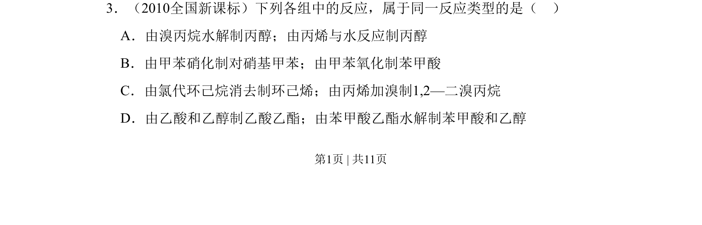
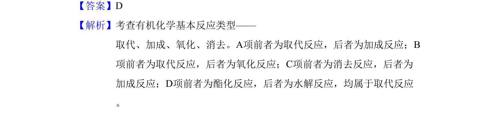

## 题面

## 摘要

本题考查有机化学反应类型的判断，涉及取代、加成、氧化、消去反应。

## 关联考点

- [[651-取代反应|取代反应]]
- [[233-乙烯加成反应|加成反应]]
- [[043-氧化反应|氧化反应]]
- [[756-消去反应|消去反应]]

## 答案与解析

> 📄 原 PDF 第 1 页：`素材/真题/吉林/2008-2024·（吉林）化学高考真题/2010年高考化学试卷（新课标）（解析卷）.pdf`
