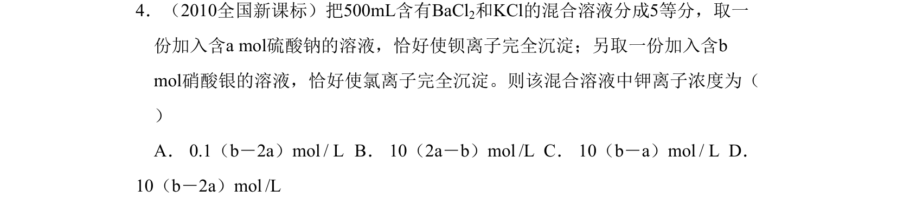
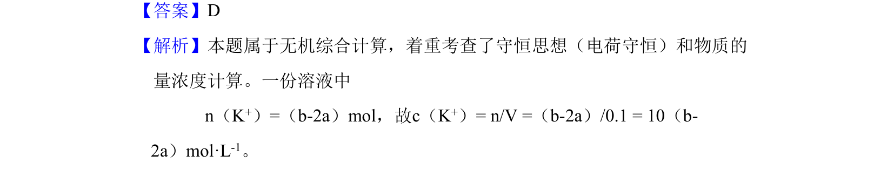

## 题面

## 摘要

无机综合计算，运用电荷守恒求K⁺物质的量浓度。

## 关联考点

- [[689-电荷数守恒|电荷守恒]]
- [[782-物质的量浓度计算|物质的量浓度计算]]

## 答案与解析

> 📄 原 PDF 第 2 页：`素材/真题/吉林/2008-2024·（吉林）化学高考真题/2010年高考化学试卷（新课标）（解析卷）.pdf`

<!-- 题干文本-start -->
## 题干文本
4．（2010全国新课标）把500mL含有BaCl2和KCl的混合溶液分成5等分，取一
份加入含a mol硫酸钠的溶液，恰好使钡离子完全沉淀；另取一份加入含b 
mol硝酸银的溶液，恰好使氯离子完全沉淀。则该混合溶液中钾离子浓度为（    
）
A． 0.1（b－2a）mol / L   B． 10（2a－b）mol /L  C． 10（b－a）mol / L   D． 
10（b－2a）mol /L
<!-- 题干文本-end -->

<!-- 解析文本-start -->
## 解析文本
【答案】D
【解析】本题属于无机综合计算，着重考查了守恒思想（电荷守恒）和物质的
量浓度计算。一份溶液中
n（K+）=（b-2a）mol，故c（K+）= n/V =（b-2a）/0.1 = 10（b-
2a）mol·L-1。
<!-- 解析文本-end -->
