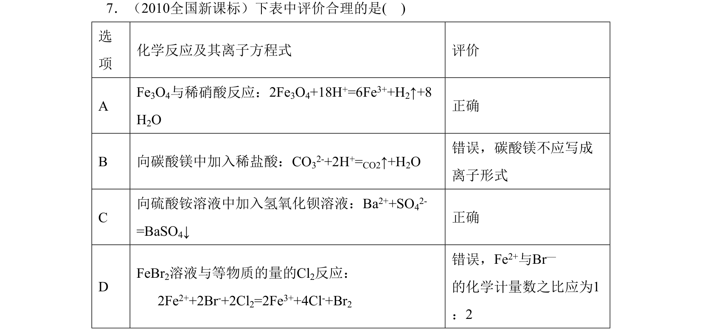
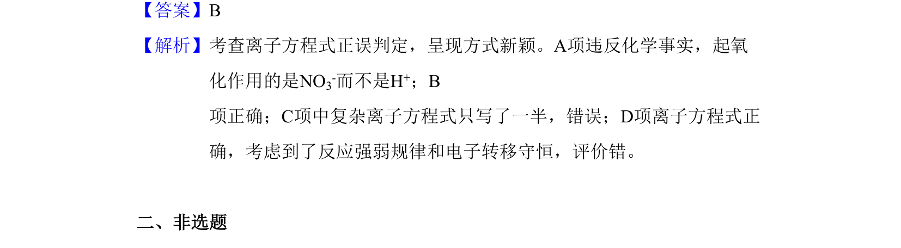

## 题面

## 摘要

该题考查离子方程式正误判定，呈现形式新颖，涉及氧化还原反应分析。

## 关联考点

- [[170-离子方程式|离子方程式]]
- [[162-氧化还原反应|氧化还原反应]]
- [[791-电子转移守恒|电子转移守恒]]
- [[648-反应规律|反应规律]]

## 答案与解析

> 📄 原 PDF 第 3 页：`素材/真题/吉林/2008-2024·（吉林）化学高考真题/2010年高考化学试卷（新课标）（解析卷）.pdf`
