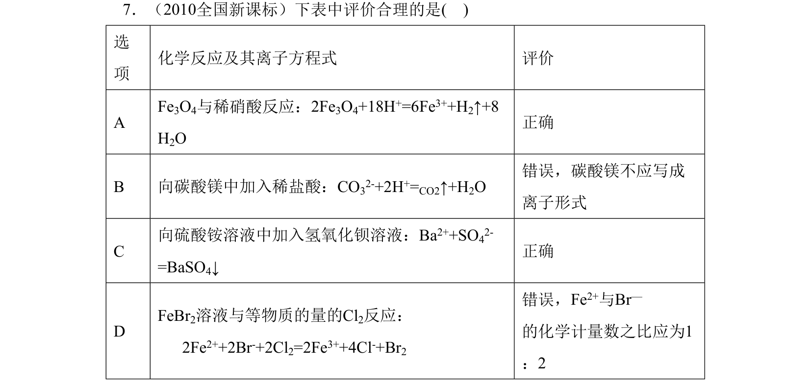
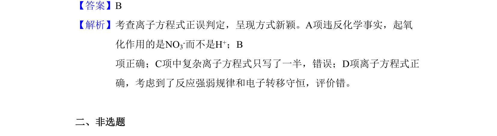

## 题面

## 摘要

该题考查离子方程式正误判定，呈现形式新颖，涉及氧化还原反应分析。

## 关联考点

- [[170-离子方程式|离子方程式]]
- [[162-氧化还原反应|氧化还原反应]]
- [[791-电子转移守恒|电子转移守恒]]
- [[648-反应规律|反应规律]]

## 答案与解析

> 📄 原 PDF 第 3 页：`素材/真题/吉林/2008-2024·（吉林）化学高考真题/2010年高考化学试卷（新课标）（解析卷）.pdf`

<!-- 题干文本-start -->
## 题干文本
7．（2010全国新课标）下表中评价合理的是(    )
选
项
化学反应及其离子方程式 评价
A
Fe3O4与稀硝酸反应：2Fe3O4+18H+=6Fe3++H2↑+8
H2O
正确
B 向碳酸镁中加入稀盐酸：CO32-+2H+=CO2↑+H2O
错误，碳酸镁不应写成
离子形式
C
向硫酸铵溶液中加入氢氧化钡溶液：Ba2++SO42-
=BaSO4↓
正确
D
FeBr2溶液与等物质的量的Cl2反应：
2Fe2++2Br-+2Cl2=2Fe3++4Cl-+Br2
错误，Fe2+与Br—
的化学计量数之比应为1
：2
<!-- 题干文本-end -->

<!-- 解析文本-start -->
## 解析文本
【答案】B
【解析】考查离子方程式正误判定，呈现方式新颖。A项违反化学事实，起氧
化作用的是NO3-而不是H+；B 
项正确；C项中复杂离子方程式只写了一半，错误；D项离子方程式正
确，考虑到了反应强弱规律和电子转移守恒，评价错。
二、非选题
<!-- 解析文本-end -->
