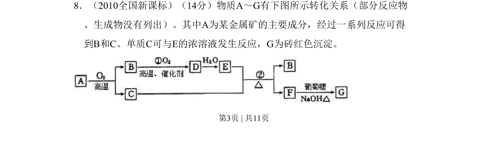
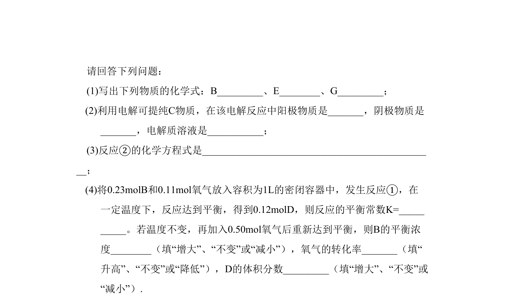
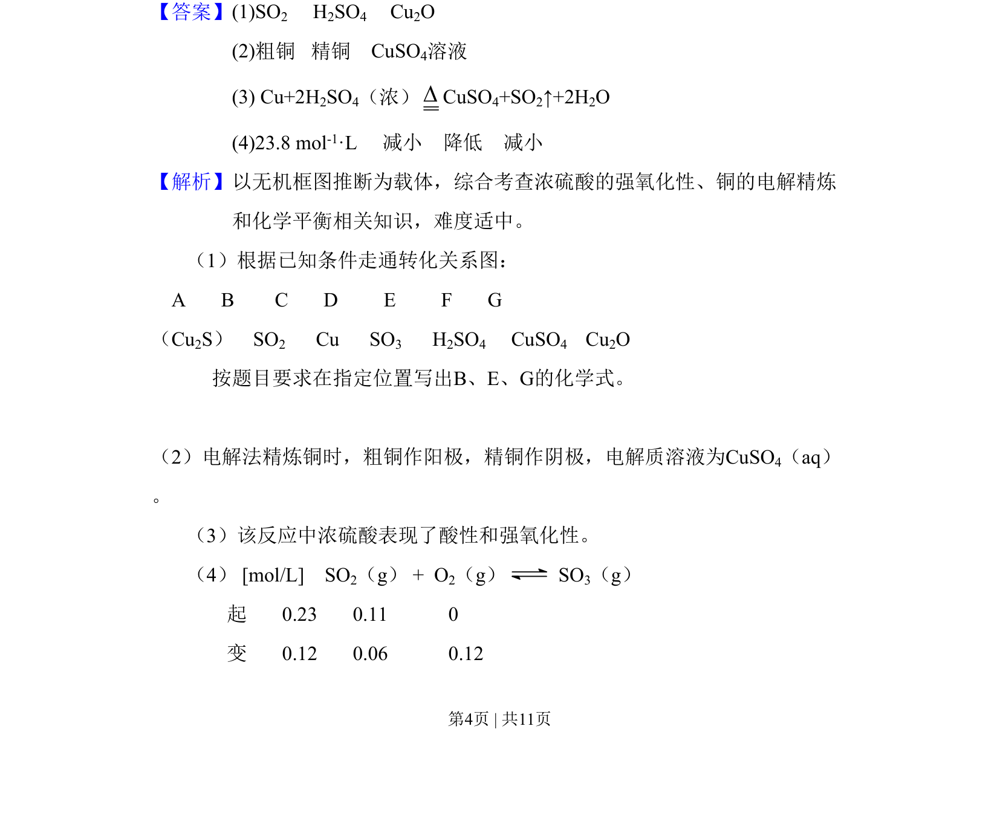
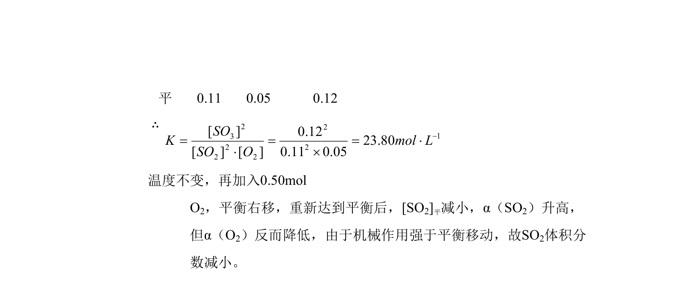

## 题面

## 摘要

以无机框图推断为载体，综合考查浓硫酸性质、铜的电解精炼和化学平衡计算

## 关联考点

- [[754-浓硫酸的强氧化性|浓硫酸的强氧化性]]
- [[370-电解精炼|电解精炼]]
- [[342-化学平衡常数|化学平衡常数]]

## 答案与解析

> 📄 原 PDF 第 3 页：`素材/真题/吉林/2008-2024·（吉林）化学高考真题/2010年高考化学试卷（新课标）（解析卷）.pdf`
