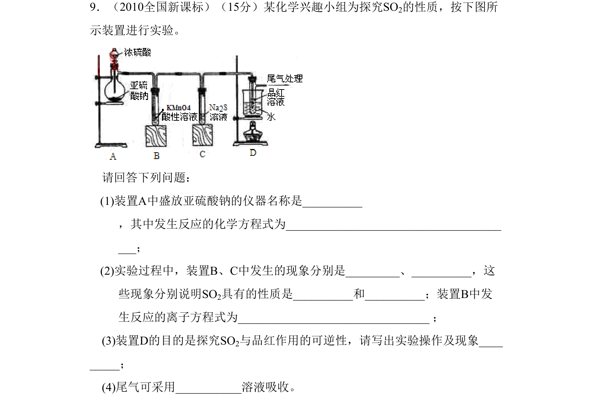
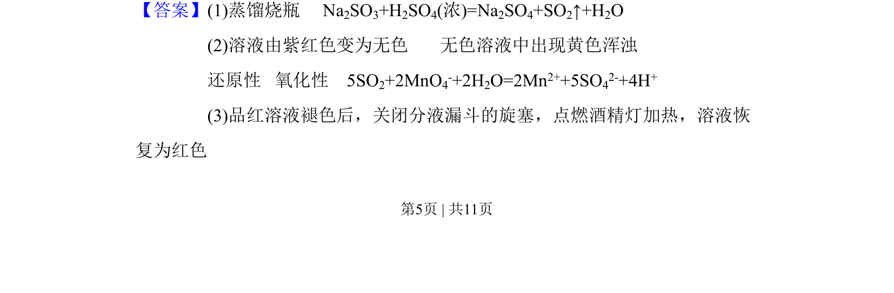
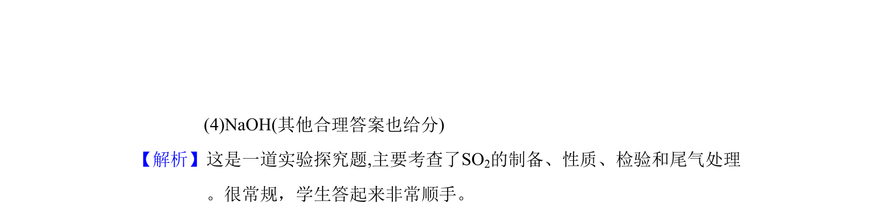

## 题面

## 摘要

实验探究题考查SO2的制备、性质、检验及尾气处理

## 关联考点

- [[582-SO2制备|SO2制备]]
- [[867-SO2性质|SO2性质]]
- [[583-SO2检验|SO2检验]]
- [[677-尾气处理|尾气处理]]

## 答案与解析

> 📄 原 PDF 第 5 页：`素材/真题/吉林/2008-2024·（吉林）化学高考真题/2010年高考化学试卷（新课标）（解析卷）.pdf`
