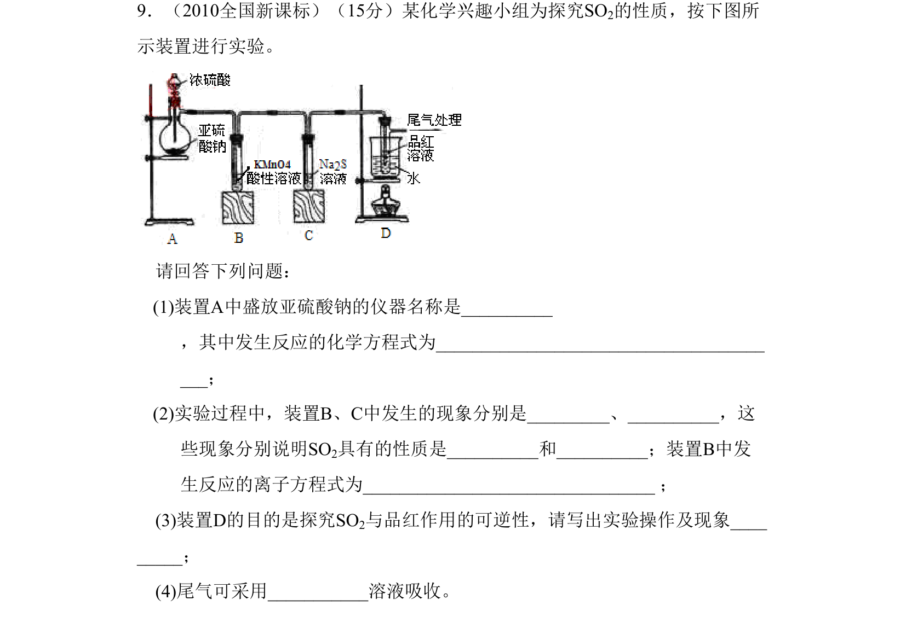
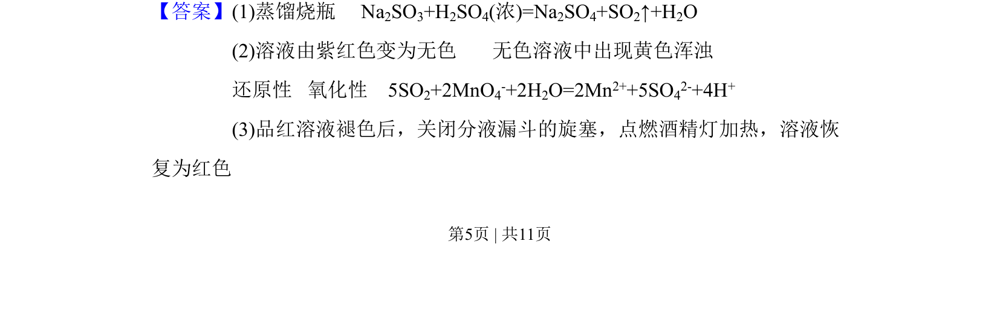
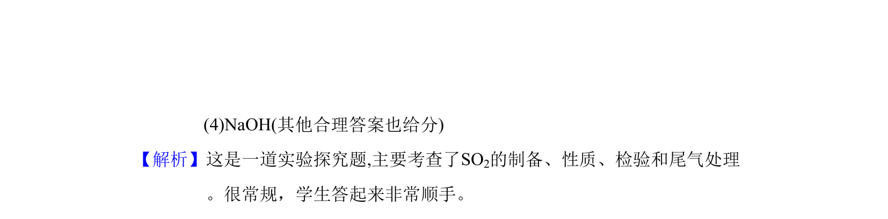

## 题面

## 摘要

实验探究题考查SO2的制备、性质、检验及尾气处理

## 关联考点

- [[582-SO2制备|SO2制备]]
- [[867-SO2性质|SO2性质]]
- [[583-SO2检验|SO2检验]]
- [[677-尾气处理|尾气处理]]

## 答案与解析

> 📄 原 PDF 第 5 页：`素材/真题/吉林/2008-2024·（吉林）化学高考真题/2010年高考化学试卷（新课标）（解析卷）.pdf`

<!-- 题干文本-start -->
## 题干文本
9．（2010全国新课标）（15分）某化学兴趣小组为探究SO2的性质，按下图所
示装置进行实验。
请回答下列问题：
(1)装置A中盛放亚硫酸钠的仪器名称是__________ 
，其中发生反应的化学方程式为____________________________________
___；
(2)实验过程中，装置B、C中发生的现象分别是_________、__________，这
些现象分别说明SO2具有的性质是__________和__________；装置B中发
生反应的离子方程式为________________________________ ；
(3)装置D的目的是探究SO2与品红作用的可逆性，请写出实验操作及现象____
_____；
(4)尾气可采用___________溶液吸收。
<!-- 题干文本-end -->

<!-- 解析文本-start -->
## 解析文本
【答案】(1)蒸馏烧瓶     Na2SO3+H2SO4(浓)=Na2SO4+SO2↑+H2O    
(2)溶液由紫红色变为无色       无色溶液中出现黄色浑浊    
还原性   氧化性    5SO2+2MnO4-+2H2O=2Mn2++5SO42-+4H+   
(3)品红溶液褪色后，关闭分液漏斗的旋塞，点燃酒精灯加热，溶液恢
复为红色
<!-- 解析文本-end -->
