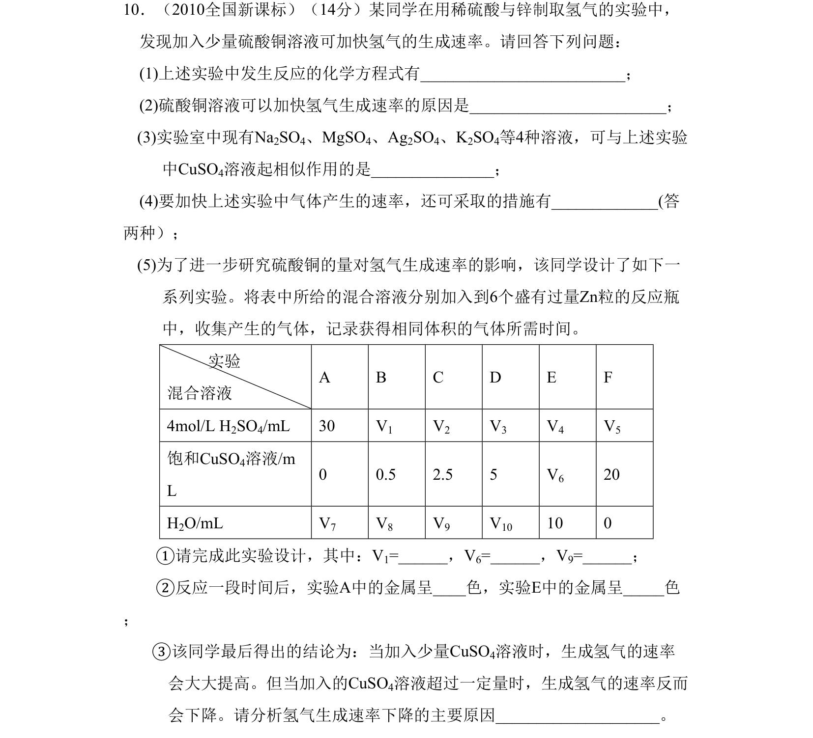
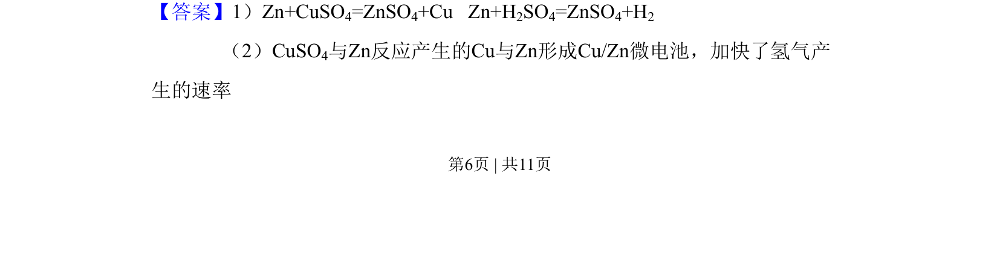
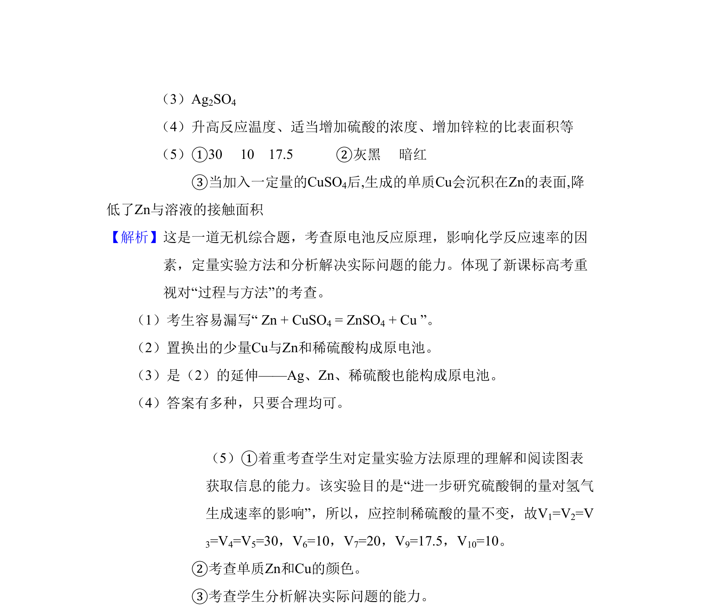

## 题面

## 摘要

该题考查原电池原理、反应速率影响因素及定量实验分析。

## 关联考点

- [[641-原电池原理|原电池原理]]
- [[687-影响化学反应速率因素|影响化学反应速率因素]]
- [[540-定量实验|定量实验]]
- [[672-实验现象分析|实验现象分析]]

## 答案与解析

> 📄 原 PDF 第 6 页：`素材/真题/吉林/2008-2024·（吉林）化学高考真题/2010年高考化学试卷（新课标）（解析卷）.pdf`
