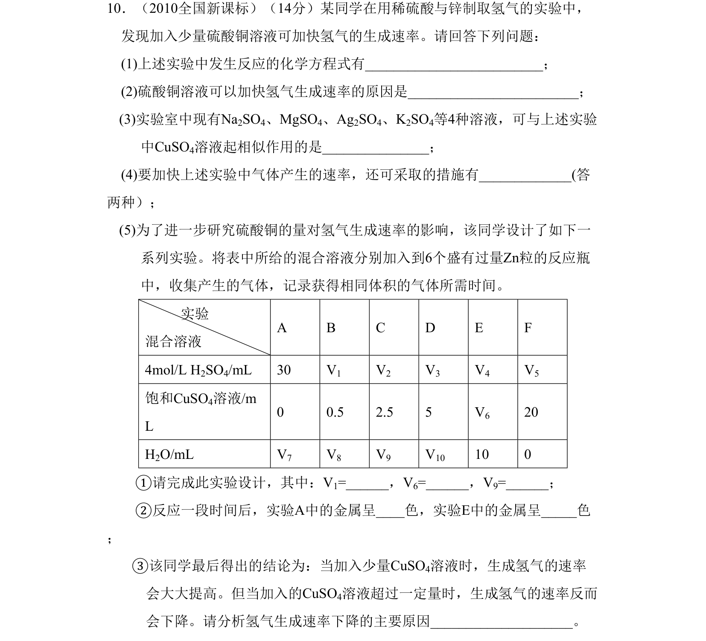
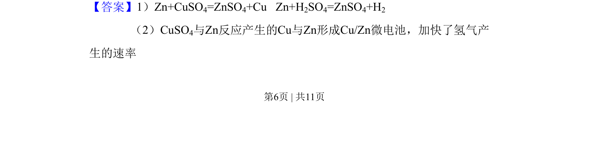
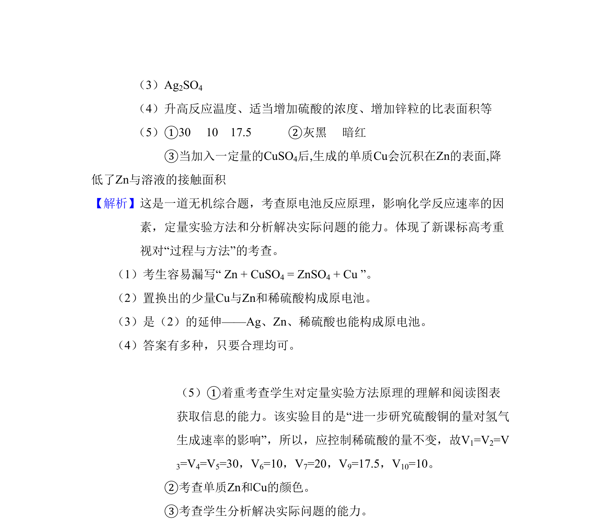

## 题面

## 摘要

该题考查原电池原理、反应速率影响因素及定量实验分析。

## 关联考点

- [[641-原电池原理|原电池原理]]
- [[687-影响化学反应速率因素|影响化学反应速率因素]]
- [[540-定量实验|定量实验]]
- [[672-实验现象分析|实验现象分析]]

## 答案与解析

> 📄 原 PDF 第 6 页：`素材/真题/吉林/2008-2024·（吉林）化学高考真题/2010年高考化学试卷（新课标）（解析卷）.pdf`

<!-- 题干文本-start -->
## 题干文本
10．（2010全国新课标）（14分）某同学在用稀硫酸与锌制取氢气的实验中，
发现加入少量硫酸铜溶液可加快氢气的生成速率。请回答下列问题：
(1)上述实验中发生反应的化学方程式有_________________________；
(2)硫酸铜溶液可以加快氢气生成速率的原因是________________________；
(3)实验室中现有Na2SO4、MgSO4、Ag2SO4、K2SO4等4种溶液，可与上述实验
中CuSO4溶液起相似作用的是_______________；
(4)要加快上述实验中气体产生的速率，还可采取的措施有_____________(答
两种）；
(5)为了进一步研究硫酸铜的量对氢气生成速率的影响，该同学设计了如下一
系列实验。将表中所给的混合溶液分别加入到6个盛有过量Zn粒的反应瓶
中，收集产生的气体，记录获得相同体积的气体所需时间。
          实验
混合溶液
A B C D E F
4mol/L H2SO4/mL 30 V1 V2 V3 V4 V5
饱和CuSO4溶液/m
L
0 0.5 2.5 5 V6 20
H2O/mL V7 V8 V9 V10 10 0
①请完成此实验设计，其中：V1=______，V6=______，V9=______；
②反应一段时间后，实验A中的金属呈____色，实验E中的金属呈_____色
；
③该同学最后得出的结论为：当加入少量CuSO4溶液时，生成氢气的速率
会大大提高。但当加入的CuSO4溶液超过一定量时，生成氢气的速率反而
会下降。请分析氢气生成速率下降的主要原因____________________。
<!-- 题干文本-end -->

<!-- 解析文本-start -->
## 解析文本
【答案】1）Zn+CuSO4=ZnSO4+Cu   Zn+H2SO4=ZnSO4+H2  
（2）CuSO4与Zn反应产生的Cu与Zn形成Cu/Zn微电池，加快了氢气产
生的速率
<!-- 解析文本-end -->
