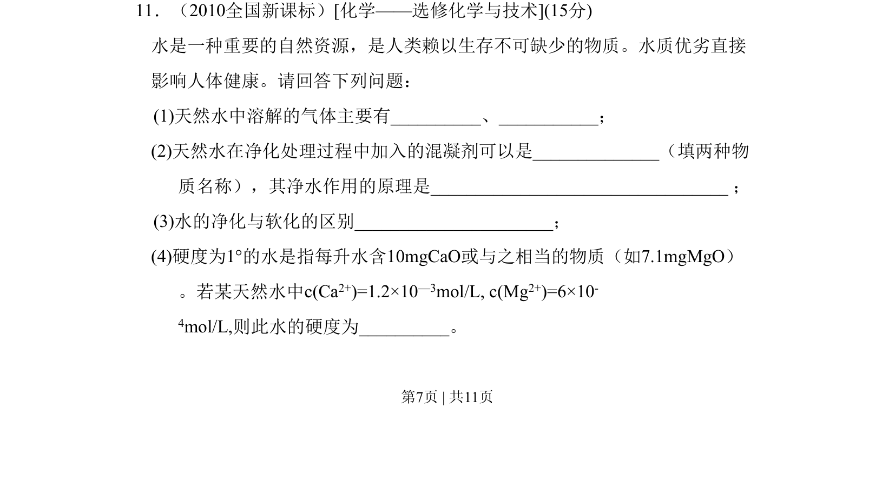
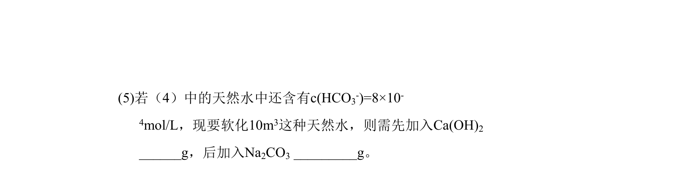
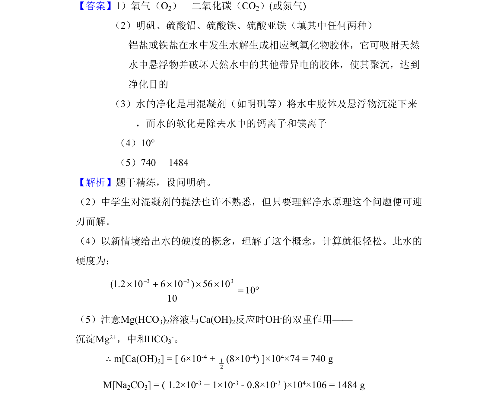

## 题面

## 摘要

考查净水原理、水的硬度概念与计算，以及软化水的化学反应与定量计算。

## 关联考点

- [[759-混凝剂净水原理|混凝剂净水原理]]
- [[741-水的硬度计算|水的硬度计算]]
- [[746-沉淀反应|沉淀反应]]
- [[137-中和反应|中和反应]]

## 答案与解析

> 📄 原 PDF 第 7 页：`素材/真题/吉林/2008-2024·（吉林）化学高考真题/2010年高考化学试卷（新课标）（解析卷）.pdf`
