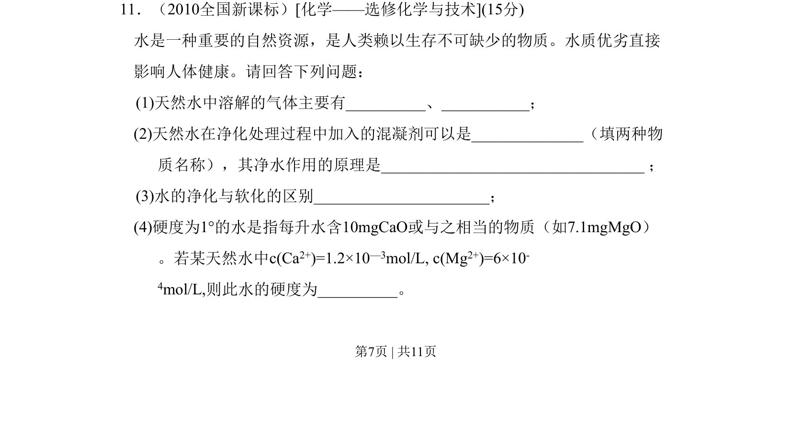
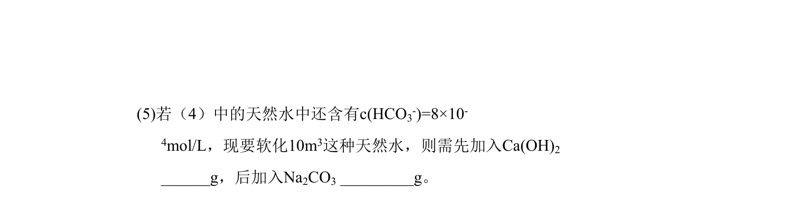
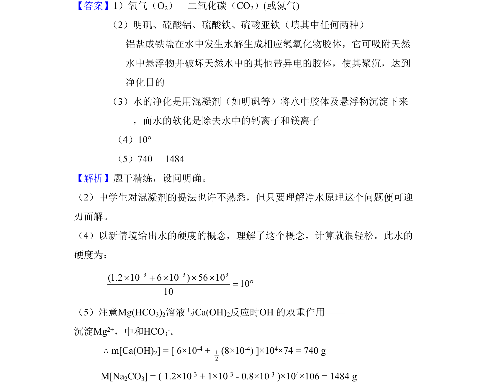

## 题面

## 摘要

考查净水原理、水的硬度概念与计算，以及软化水的化学反应与定量计算。

## 关联考点

- [[758-混凝剂净水原理|混凝剂净水原理]]
- [[740-水的硬度计算|水的硬度计算]]
- [[745-沉淀反应|沉淀反应]]
- [[137-中和反应|中和反应]]

## 答案与解析

> 📄 原 PDF 第 7 页：`素材/真题/吉林/2008-2024·（吉林）化学高考真题/2010年高考化学试卷（新课标）（解析卷）.pdf`

<!-- 题干文本-start -->
## 题干文本
11．（2010全国新课标）[化学——选修化学与技术](15分)
水是一种重要的自然资源，是人类赖以生存不可缺少的物质。水质优劣直接
影响人体健康。请回答下列问题：
(1)天然水中溶解的气体主要有__________、___________；
(2)天然水在净化处理过程中加入的混凝剂可以是______________（填两种物
质名称），其净水作用的原理是_________________________________ ；
(3)水的净化与软化的区别______________________；
(4)硬度为1°的水是指每升水含10mgCaO或与之相当的物质（如7.1mgMgO）
。若某天然水中c(Ca2+)=1.2×10—3mol/L, c(Mg2+)=6×10-
4mol/L,则此水的硬度为__________。
<!-- 题干文本-end -->

<!-- 解析文本-start -->
## 解析文本

<!-- 解析文本-end -->
