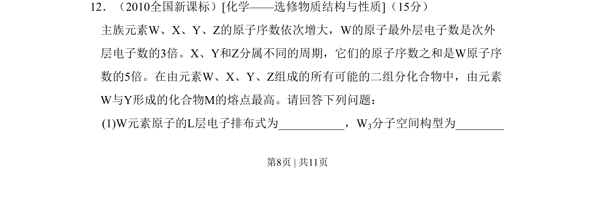
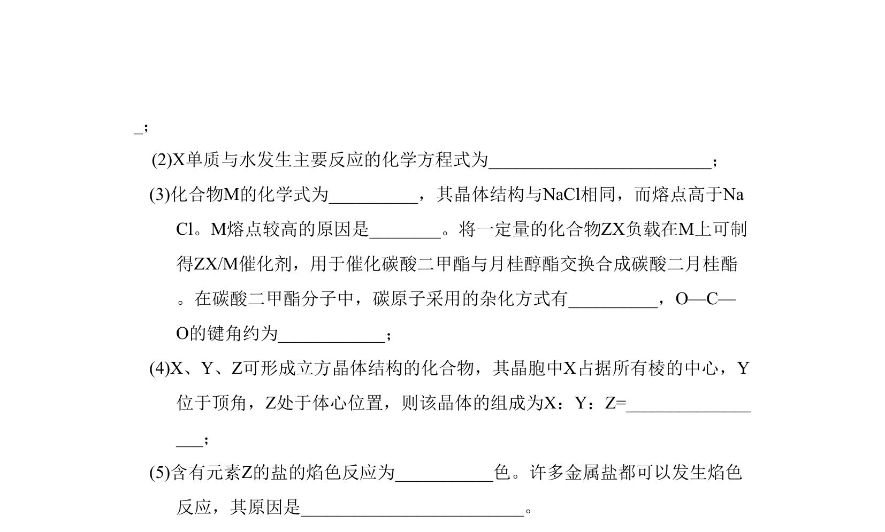
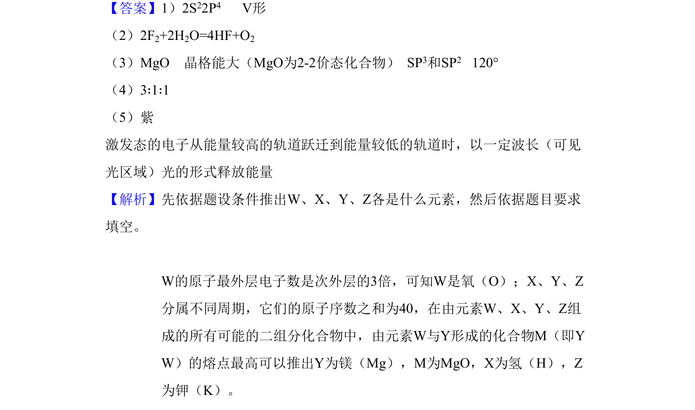

## 题面

## 摘要

推断元素种类并分析化合物性质，考查原子结构与元素周期表关系。

## 关联考点

- [[426-原子结构|原子结构]]
- [[252-元素周期律|元素周期律]]
- [[805-离子化合物熔点|离子化合物熔点]]

## 答案与解析

> 📄 原 PDF 第 8 页：`素材/真题/吉林/2008-2024·（吉林）化学高考真题/2010年高考化学试卷（新课标）（解析卷）.pdf`
