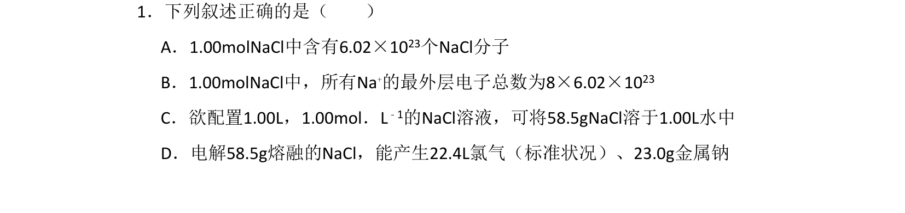
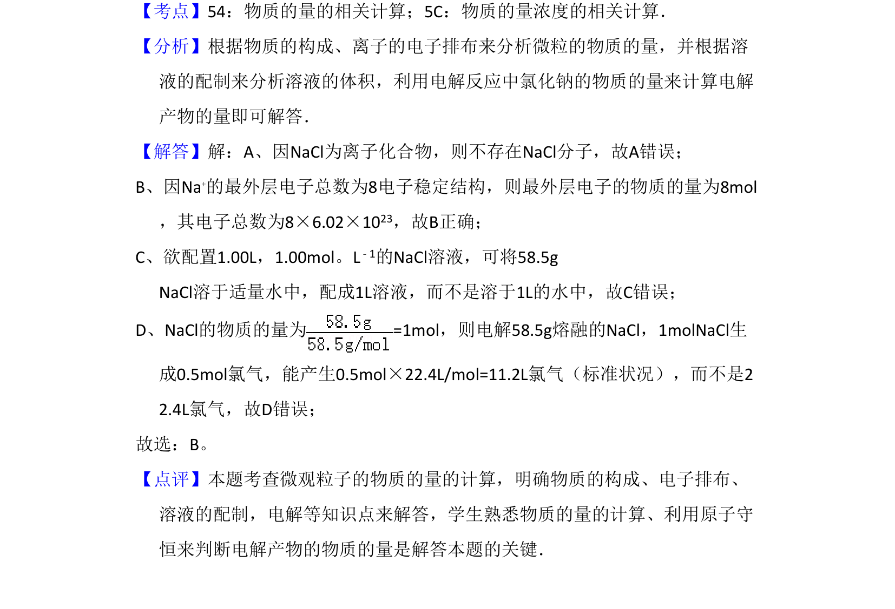

## 题面

## 摘要

本题考查物质的量相关概念辨析与计算，涉及电解质结构、溶液配制、电解产物计算。

## 关联考点

- [[780-物质的量|物质的量]]
- [[898-离子电子排布|离子电子排布]]
- [[764-溶液配制|溶液配制]]
- [[798-电解计算|电解计算]]

## 答案与解析

> 📄 原 PDF 第 1 页：`素材/真题/吉林/2008-2024·（吉林）化学高考真题/2011年高考化学试卷（新课标）（解析卷）.pdf`
