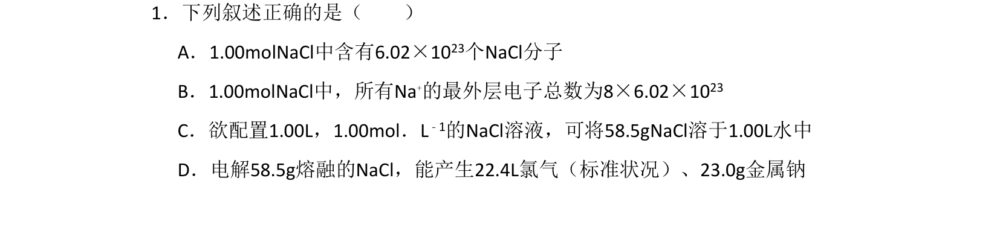
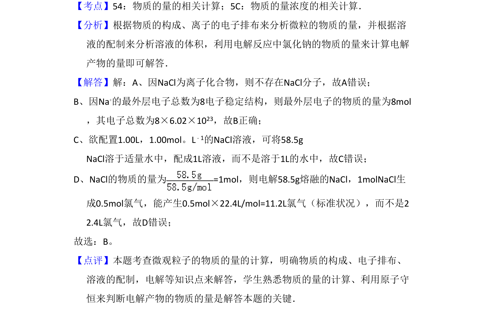

## 题面

## 摘要

本题考查物质的量相关概念辨析与计算，涉及电解质结构、溶液配制、电解产物计算。

## 关联考点

- [[779-物质的量|物质的量]]
- [[897-离子电子排布|离子电子排布]]
- [[763-溶液配制|溶液配制]]
- [[797-电解计算|电解计算]]

## 答案与解析

> 📄 原 PDF 第 1 页：`素材/真题/吉林/2008-2024·（吉林）化学高考真题/2011年高考化学试卷（新课标）（解析卷）.pdf`

<!-- 题干文本-start -->
## 题干文本
1．下列叙述正确的是（　　）
A．1.00molNaCl中含有6.02×1023个NaCl分子
B．1.00molNaCl中，所有Na+的最外层电子总数为8×6.02×1023
C．欲配置1.00L，1.00mol．L﹣1的NaCl溶液，可将58.5gNaCl溶于1.00L水中
D．电解58.5g熔融的NaCl，能产生22.4L氯气（标准状况）、23.0g金属钠
<!-- 题干文本-end -->

<!-- 解析文本-start -->
## 解析文本
【考点】54：物质的量的相关计算；5C：物质的量浓度的相关计算．菁优网版权所有
【分析】根据物质的构成、离子的电子排布来分析微粒的物质的量，并根据溶
液的配制来分析溶液的体积，利用电解反应中氯化钠的物质的量来计算电解
产物的量即可解答．
【解答】解：A、因NaCl为离子化合物，则不存在NaCl分子，故A错误；
B、因Na+的最外层电子总数为8电子稳定结构，则最外层电子的物质的量为8mol
，其电子总数为8×6.02×1023，故B正确；
C、欲配置1.00L，1.00mol。L﹣1的NaCl溶液，可将58.5g 
NaCl溶于适量水中，配成1L溶液，而不是溶于1L的水中，故C错误；
D、NaCl的物质的量为=1mol，则电解58.5g熔融的NaCl，1molNaCl生
成0.5mol氯气，能产生0.5mol×22.4L/mol=11.2L氯气（标准状况），而不是2
<!-- 解析文本-end -->
