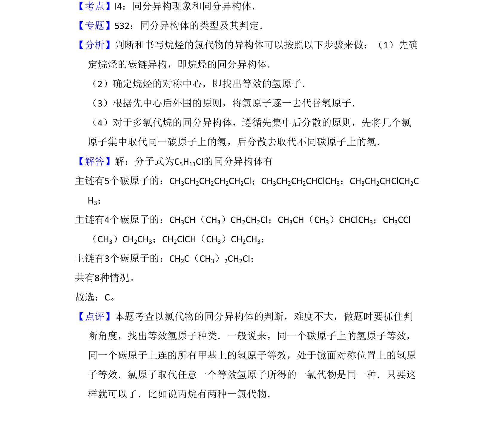

## 题面

## 摘要

考查戊基氯代物的同分异构体数目分析，涉及碳链异构和位置异构的计数。

## 关联考点

- [[446-同分异构体|同分异构体]]
- [[706-有机化学|有机化学]]
- [[836-计数|计数]]

## 答案与解析

> 📄 原 PDF 第 1 页：`素材/真题/吉林/2008-2024·（吉林）化学高考真题/2011年高考化学试卷（新课标）（解析卷）.pdf`
