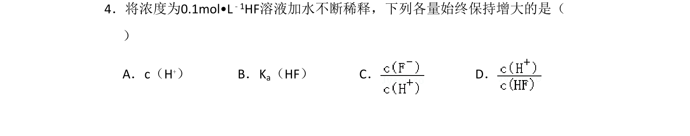
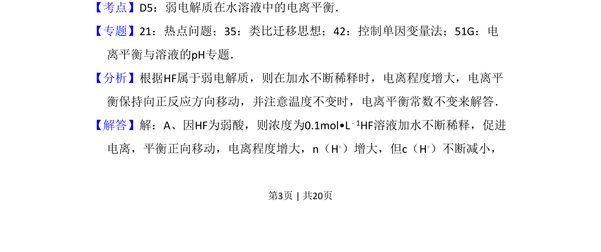
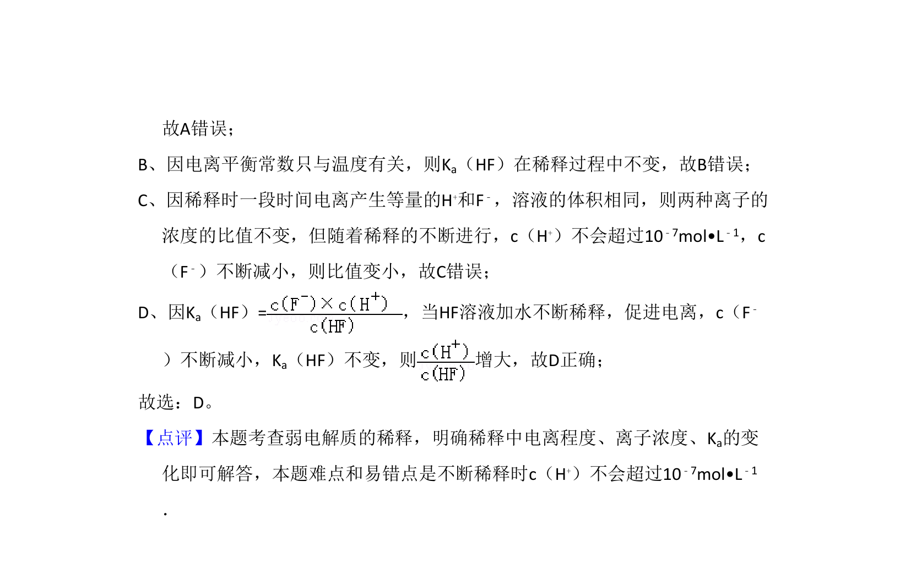

## 题面

## 摘要

弱电解质稀释时离子浓度与平衡常数的变化分析

## 关联考点

- [[544-弱电解质电离平衡|弱电解质电离平衡]]
- [[334-电离平衡|电离平衡常数]]
- [[752-浓度变化|浓度变化]]

## 答案与解析

> 📄 原 PDF 第 3 页：`素材/真题/吉林/2008-2024·（吉林）化学高考真题/2011年高考化学试卷（新课标）（解析卷）.pdf`
