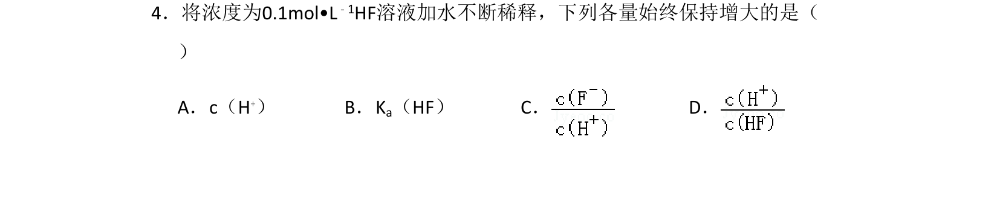
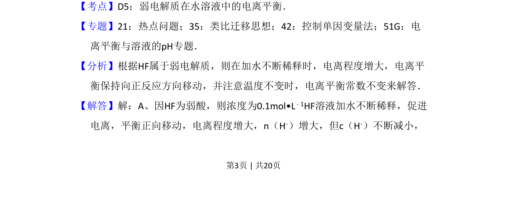
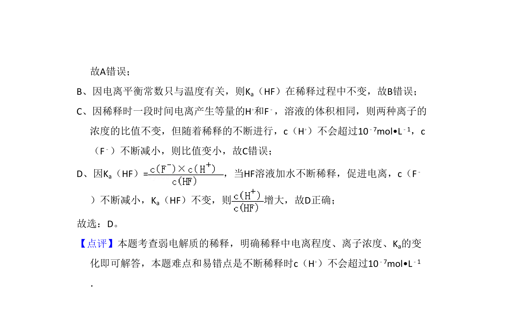

## 题面

## 摘要

弱电解质稀释时离子浓度与平衡常数的变化分析

## 关联考点

- [[928-弱电解质的电离平衡|弱电解质电离平衡]]
- [[334-电离平衡|电离平衡常数]]
- [[751-浓度变化|浓度变化]]

## 答案与解析

> 📄 原 PDF 第 3 页：`素材/真题/吉林/2008-2024·（吉林）化学高考真题/2011年高考化学试卷（新课标）（解析卷）.pdf`

<!-- 题干文本-start -->
## 题干文本
4．将浓度为0.1mol•L﹣1HF溶液加水不断稀释，下列各量始终保持增大的是（　　
）
A．c（H+）B．K a（HF）C．D．
<!-- 题干文本-end -->

<!-- 解析文本-start -->
## 解析文本
【考点】D5：弱电解质在水溶液中的电离平衡．菁优网版权所有
【专题】21：热点问题；35：类比迁移思想；42：控制单因变量法；51G：电
离平衡与溶液的pH专题．
【分析】根据HF属于弱电解质，则在加水不断稀释时，电离程度增大，电离平
衡保持向正反应方向移动，并注意温度不变时，电离平衡常数不变来解答．
【解答】解：A、因HF为弱酸，则浓度为0.1mol•L﹣1HF溶液加水不断稀释，促进
电离，平衡正向移动，电离程度增大，n（H+）增大，但c（H+）不断减小，
<!-- 解析文本-end -->
