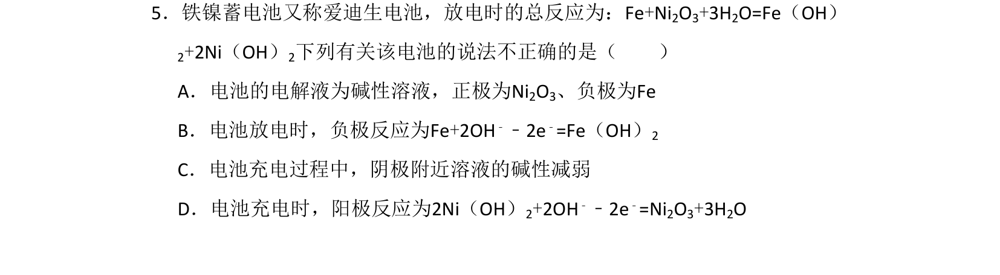
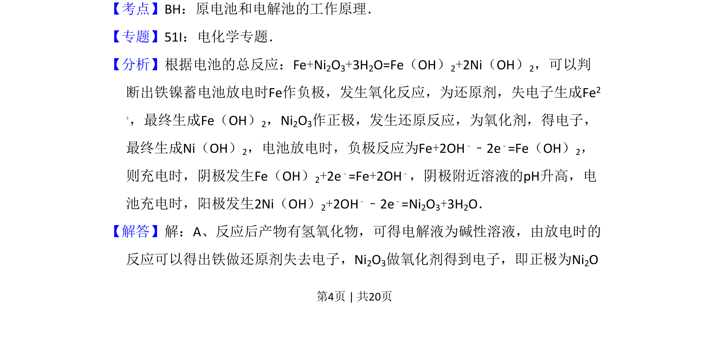
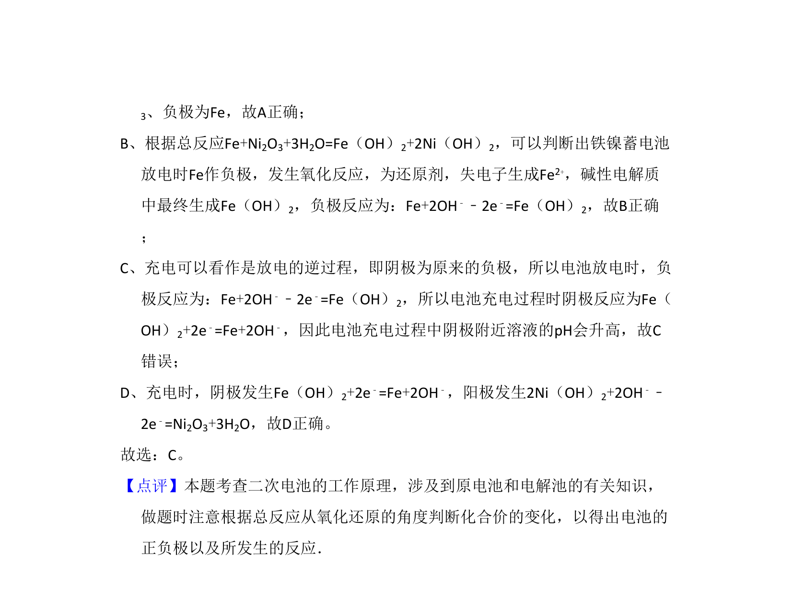

## 题面

## 摘要

该题考查铁镍蓄电池的工作原理，涉及放电与充电时的电极反应和电解液酸碱性变化。

## 关联考点

- [[287-原电池|原电池]]
- [[368-电解池|电解池]]
- [[794-电极反应|电极反应]]
- [[790-电化学|电化学]]

## 答案与解析

> 📄 原 PDF 第 4 页：`素材/真题/吉林/2008-2024·（吉林）化学高考真题/2011年高考化学试卷（新课标）（解析卷）.pdf`
