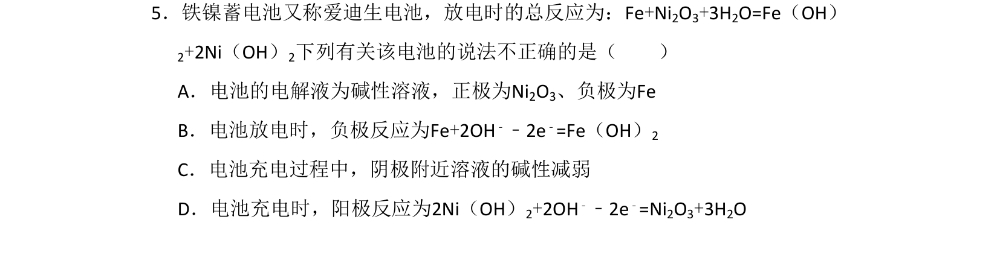
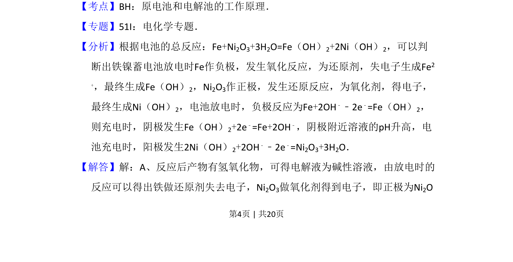
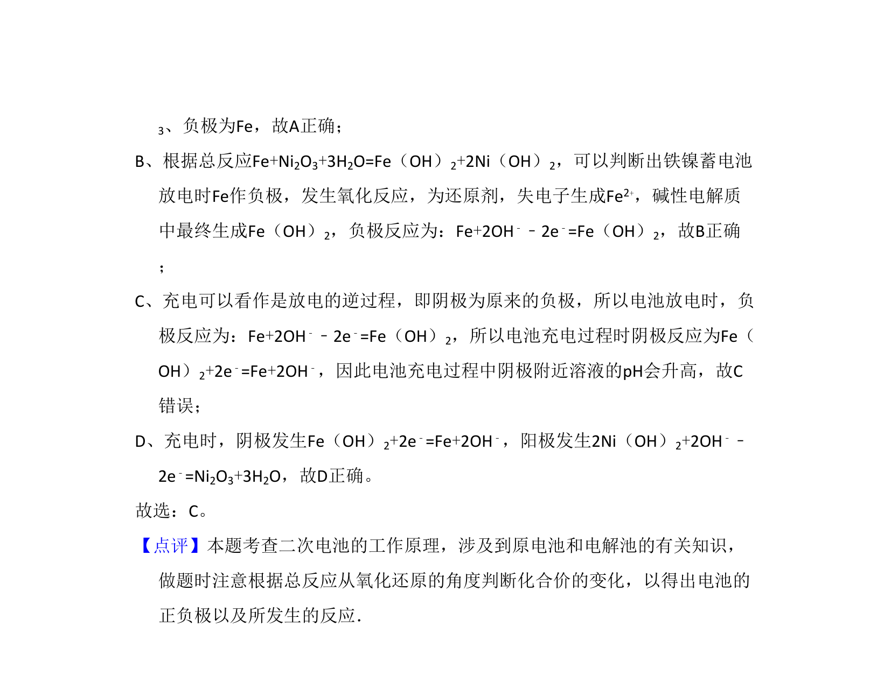

## 题面

## 摘要

该题考查铁镍蓄电池的工作原理，涉及放电与充电时的电极反应和电解液酸碱性变化。

## 关联考点

- [[287-原电池|原电池]]
- [[368-电解池|电解池]]
- [[793-电极反应|电极反应]]
- [[789-电化学|电化学]]

## 答案与解析

> 📄 原 PDF 第 4 页：`素材/真题/吉林/2008-2024·（吉林）化学高考真题/2011年高考化学试卷（新课标）（解析卷）.pdf`

<!-- 题干文本-start -->
## 题干文本
5．铁镍蓄电池又称爱迪生电池，放电时的总反应为：Fe+Ni2O3+3H2O=Fe（OH）
2+2Ni（OH）2下列有关该电池的说法不正确的是（　　）
A．电池的电解液为碱性溶液，正极为Ni2O3、负极为Fe
B．电池放电时，负极反应为Fe+2OH﹣﹣2e﹣=Fe（OH）2
C．电池充电过程中，阴极附近溶液的碱性减弱
D．电池充电时，阳极反应为2Ni（OH）2+2OH﹣﹣2e﹣=Ni2O3+3H2O
<!-- 题干文本-end -->

<!-- 解析文本-start -->
## 解析文本
【考点】BH：原电池和电解池的工作原理．菁优网版权所有
【专题】51I：电化学专题．
【分析】根据电池的总反应：Fe+Ni2O3+3H2O=Fe（OH）2+2Ni（OH）2，可以判
断出铁镍蓄电池放电时Fe作负极，发生氧化反应，为还原剂，失电子生成Fe2
+，最终生成Fe（OH）2，Ni2O3作正极，发生还原反应，为氧化剂，得电子，
最终生成Ni（OH）2，电池放电时，负极反应为Fe+2OH﹣﹣2e﹣=Fe（OH）2，
则充电时，阴极发生Fe（OH）2+2e﹣=Fe+2OH﹣，阴极附近溶液的pH升高，电
池充电时，阳极发生2Ni（OH）2+2OH﹣﹣2e﹣=Ni2O3+3H2O．
【解答】解：A、反应后产物有氢氧化物，可得电解液为碱性溶液，由放电时的
反应可以得出铁做还原剂失去电子，Ni2O3做氧化剂得到电子，即正极为Ni2O
<!-- 解析文本-end -->
