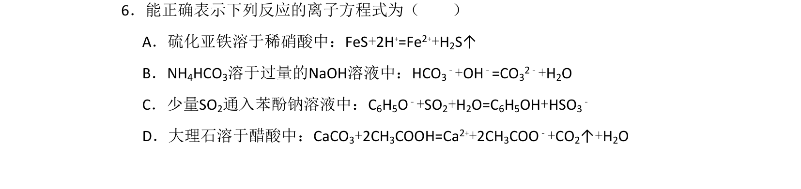
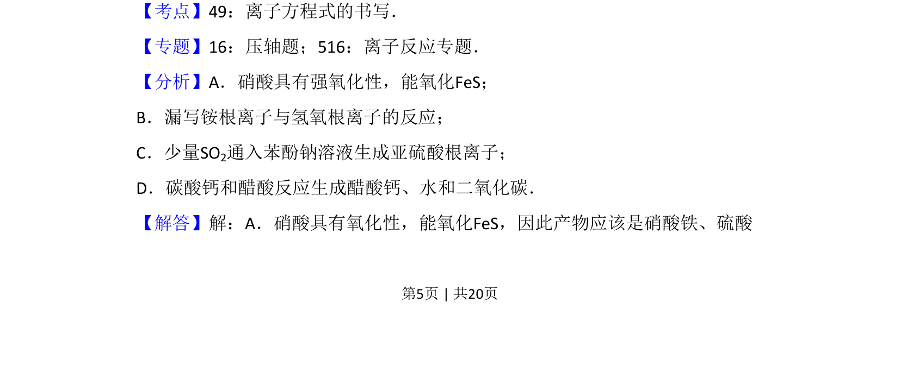
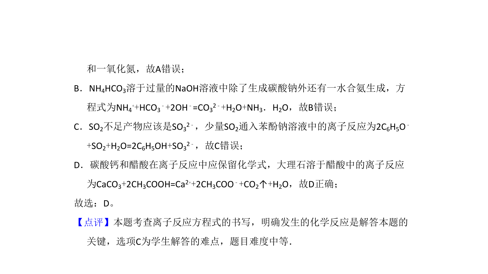

## 题面

## 摘要

该题考查离子方程式正误判断，涉及氧化还原反应和离子反应书写规则。

## 关联考点

- [[离子方程式的书写]]
- [[162-氧化还原反应|氧化还原反应]]
- [[169-离子反应|离子反应]]

## 答案与解析

> 📄 原 PDF 第 5 页：`素材/真题/吉林/2008-2024·（吉林）化学高考真题/2011年高考化学试卷（新课标）（解析卷）.pdf`
