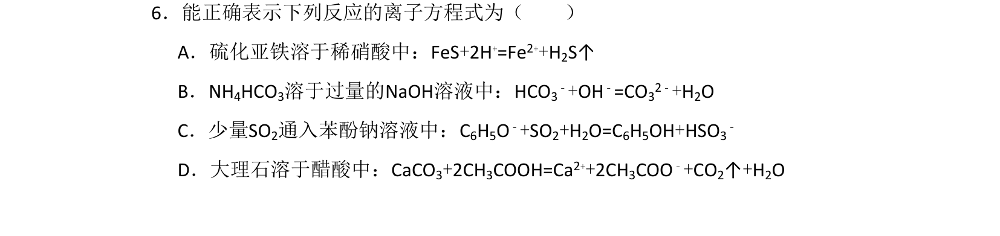
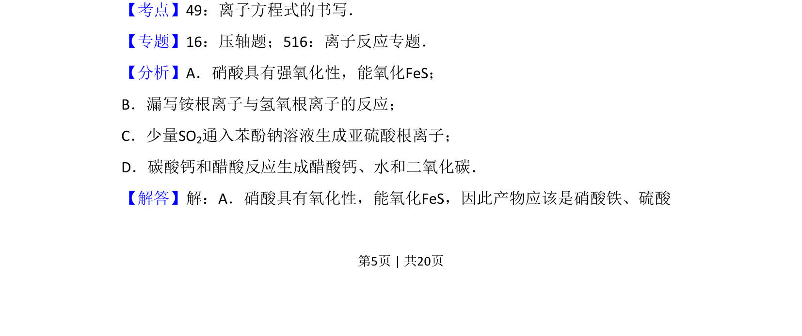
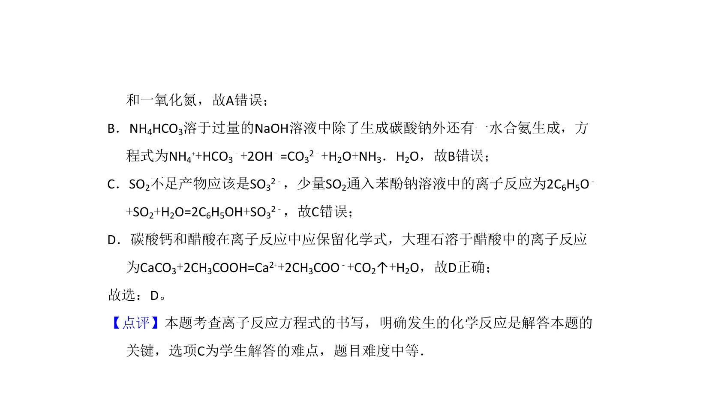

## 题面

## 摘要

该题考查离子方程式正误判断，涉及氧化还原反应和离子反应书写规则。

## 关联考点

- [[807-离子方程式的书写|离子方程式的书写]]
- [[162-氧化还原反应|氧化还原反应]]
- [[169-离子反应|离子反应]]

## 答案与解析

> 📄 原 PDF 第 5 页：`素材/真题/吉林/2008-2024·（吉林）化学高考真题/2011年高考化学试卷（新课标）（解析卷）.pdf`

<!-- 题干文本-start -->
## 题干文本
6．能正确表示下列反应的离子方程式为（　　）
A．硫化亚铁溶于稀硝酸中：FeS+2H+=Fe2++H2S↑
B．NH4HCO3溶于过量的NaOH溶液中：HCO3
﹣+OH﹣=CO32﹣+H2O
C．少量SO2通入苯酚钠溶液中：C6H5O﹣+SO2+H2O=C6H5OH+HSO3
﹣
D．大理石溶于醋酸中：CaCO3+2CH3COOH=Ca2++2CH3COO﹣+CO2↑+H2O
<!-- 题干文本-end -->

<!-- 解析文本-start -->
## 解析文本
【考点】49：离子方程式的书写．菁优网版权所有
【专题】16：压轴题；516：离子反应专题．
【分析】A．硝酸具有强氧化性，能氧化FeS；
B．漏写铵根离子与氢氧根离子的反应；
C．少量SO2通入苯酚钠溶液生成亚硫酸根离子；
D．碳酸钙和醋酸反应生成醋酸钙、水和二氧化碳．
【解答】解：A．硝酸具有氧化性，能氧化FeS，因此产物应该是硝酸铁、硫酸
<!-- 解析文本-end -->
