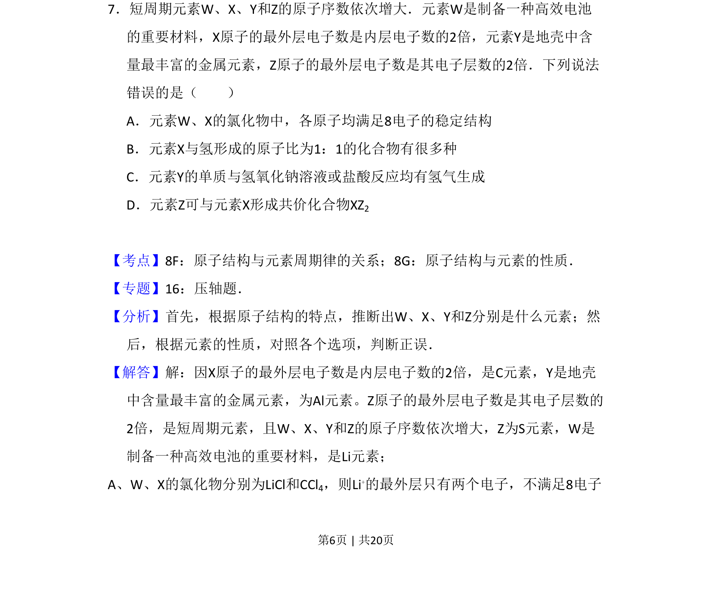
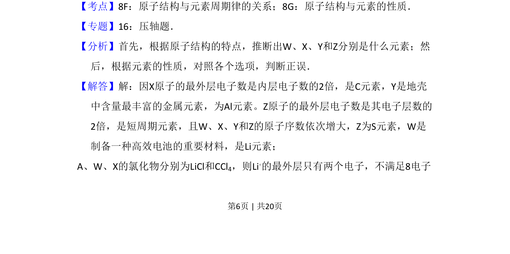
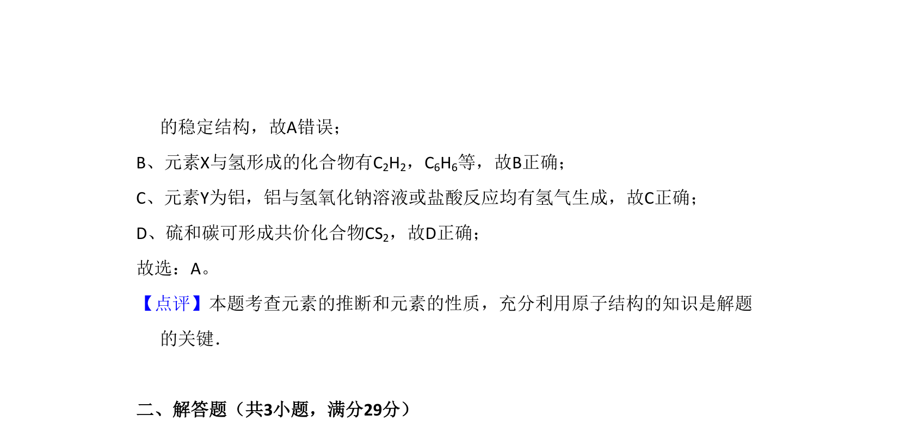

## 题面

## 摘要

该题考查元素推断及原子结构性质，需根据原子结构特征推断元素并判断选项正误。

## 关联考点

- [[531-原子结构与元素周期律的关系|原子结构与元素周期律的关系]]
- [[639-原子结构与元素的性质|原子结构与元素的性质]]

## 答案与解析

> 📄 原 PDF 第 6 页：`素材/真题/吉林/2008-2024·（吉林）化学高考真题/2011年高考化学试卷（新课标）（解析卷）.pdf`

<!-- 题干文本-start -->
## 题干文本
7．短周期元素W、X、Y和Z的原子序数依次增大．元素W是制备一种高效电池
的重要材料，X原子的最外层电子数是内层电子数的2倍，元素Y是地壳中含
量最丰富的金属元素，Z原子的最外层电子数是其电子层数的2倍．下列说法
错误的是（　　）
A．元素W、X的氯化物中，各原子均满足8电子的稳定结构
B．元素X与氢形成的原子比为1：1的化合物有很多种
C．元素Y的单质与氢氧化钠溶液或盐酸反应均有氢气生成
D．元素Z可与元素X形成共价化合物XZ2
<!-- 题干文本-end -->

<!-- 解析文本-start -->
## 解析文本
【考点】8F：原子结构与元素周期律的关系；8G：原子结构与元素的性质．菁优网版权所有
【专题】16：压轴题．
【分析】首先，根据原子结构的特点，推断出W、X、Y和Z分别是什么元素；然
后，根据元素的性质，对照各个选项，判断正误．
【解答】解：因X原子的最外层电子数是内层电子数的2倍，是C元素，Y是地壳
中含量最丰富的金属元素，为Al元素。Z原子的最外层电子数是其电子层数的
2倍，是短周期元素，且W、X、Y和Z的原子序数依次增大，Z为S元素，W是
制备一种高效电池的重要材料，是Li元素；
A、W、X的氯化物分别为LiCl和CCl4，则Li+的最外层只有两个电子，不满足8电子
<!-- 解析文本-end -->
