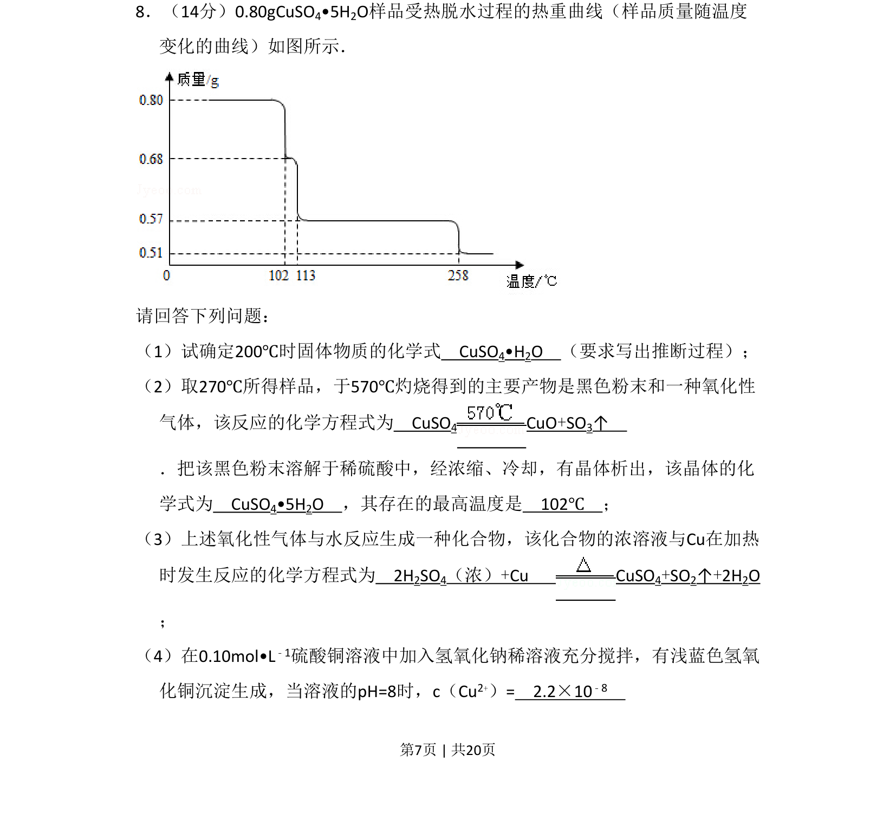
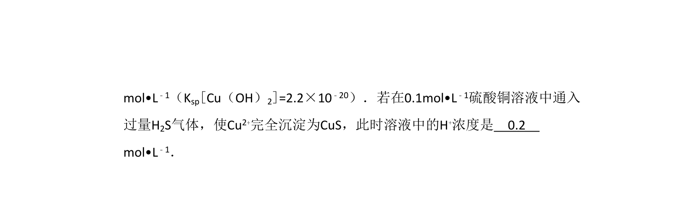
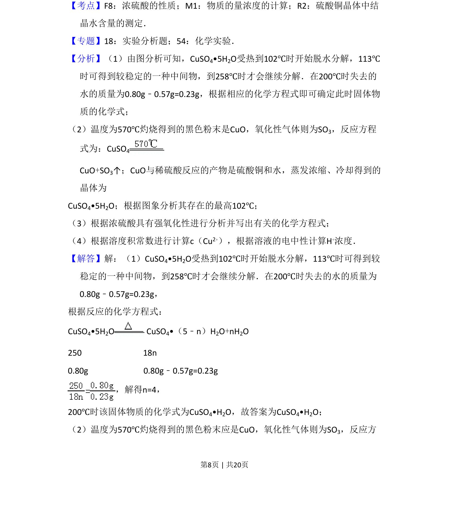
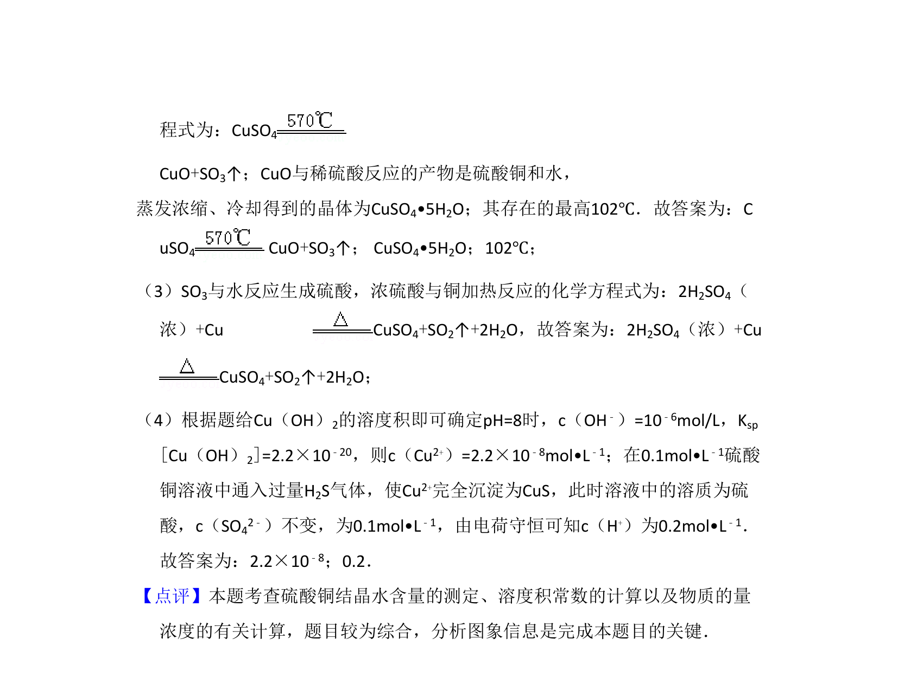

## 题面

## 摘要

通过热重曲线推断硫酸铜晶体脱水产物，书写相关反应方程式并进行沉淀溶解平衡计算。

## 关联考点

- [[热重曲线分析]]
- [[无水盐化学式推断]]
- [[铜及其化合物性质]]
- [[溶度积计算]]

## 答案与解析

> 📄 原 PDF 第 7 页：`素材/真题/吉林/2008-2024·（吉林）化学高考真题/2011年高考化学试卷（新课标）（解析卷）.pdf`
