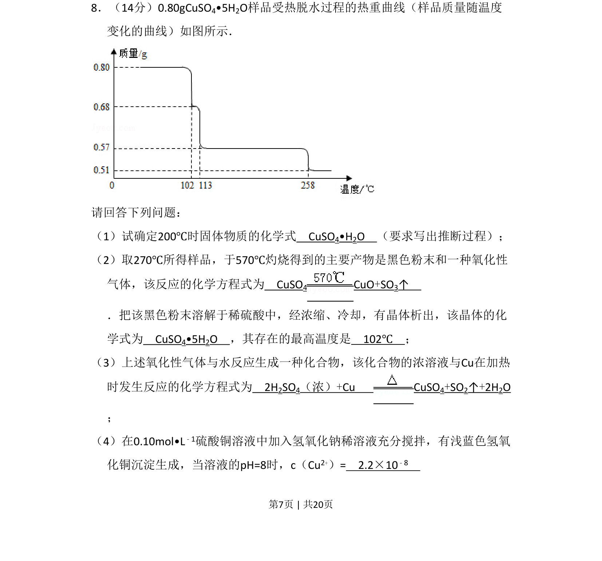
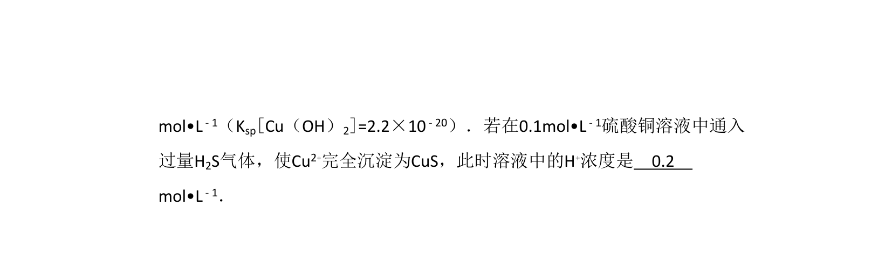
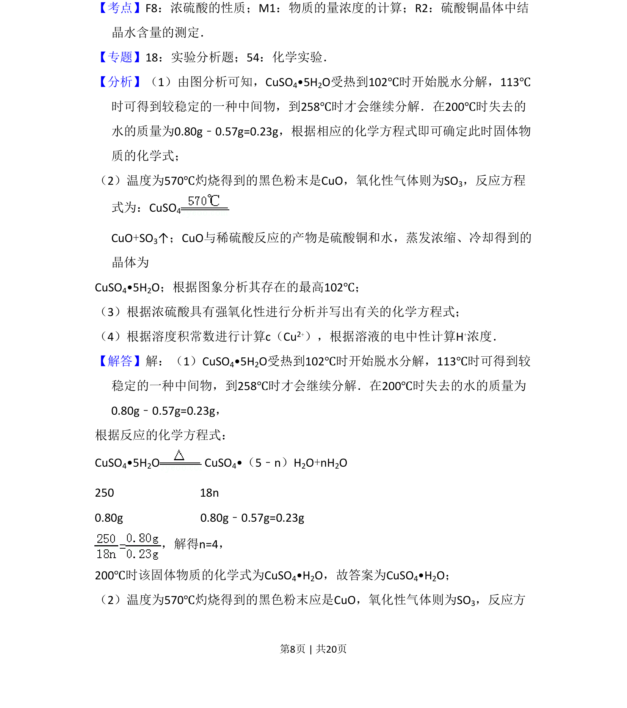
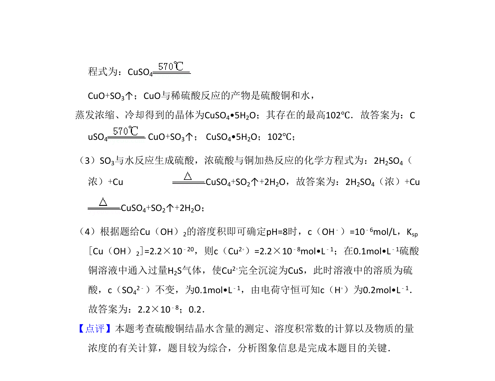

## 题面

## 摘要

通过热重曲线推断硫酸铜晶体脱水产物，书写相关反应方程式并进行沉淀溶解平衡计算。

## 关联考点

- [[770-热重曲线分析|热重曲线分析]]
- [[697-无水盐化学式推断|无水盐化学式推断]]
- [[862-铜及其化合物性质|铜及其化合物性质]]
- [[891-溶度积计算|溶度积计算]]

## 答案与解析

> 📄 原 PDF 第 7 页：`素材/真题/吉林/2008-2024·（吉林）化学高考真题/2011年高考化学试卷（新课标）（解析卷）.pdf`

<!-- 题干文本-start -->
## 题干文本
8．（14分）0.80gCuSO4•5H2O样品受热脱水过程的热重曲线（样品质量随温度
变化的曲线）如图所示．
请回答下列问题：
（1）试确定200℃时固体物质的化学式　CuSO4•H2O　（要求写出推断过程）；
（2）取270℃所得样品，于570℃灼烧得到的主要产物是黑色粉末和一种氧化性
气体，该反应的化学方程式为　CuSO4 CuO+SO3↑　
．把该黑色粉末溶解于稀硫酸中，经浓缩、冷却，有晶体析出，该晶体的化
学式为　CuSO4•5H2O　，其存在的最高温度是　102℃　；
（3）上述氧化性气体与水反应生成一种化合物，该化合物的浓溶液与Cu在加热
时发生反应的化学方程式为　2H2SO4（浓）+Cu CuSO4+SO2↑+2H2O　
；
（4）在0.10mol•L﹣1硫酸铜溶液中加入氢氧化钠稀溶液充分搅拌，有浅蓝色氢氧
化铜沉淀生成，当溶液的pH=8时，c（Cu2+）=　2.2×10﹣8
<!-- 题干文本-end -->

<!-- 解析文本-start -->
## 解析文本

<!-- 解析文本-end -->
