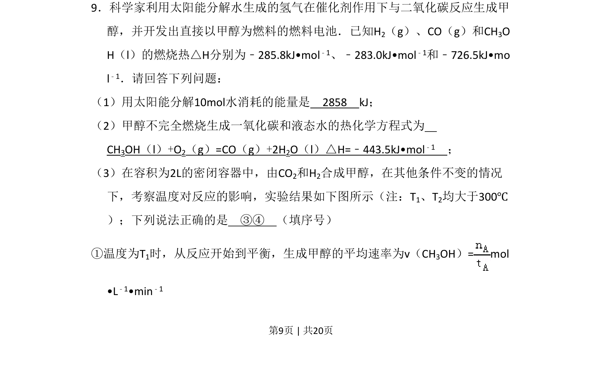
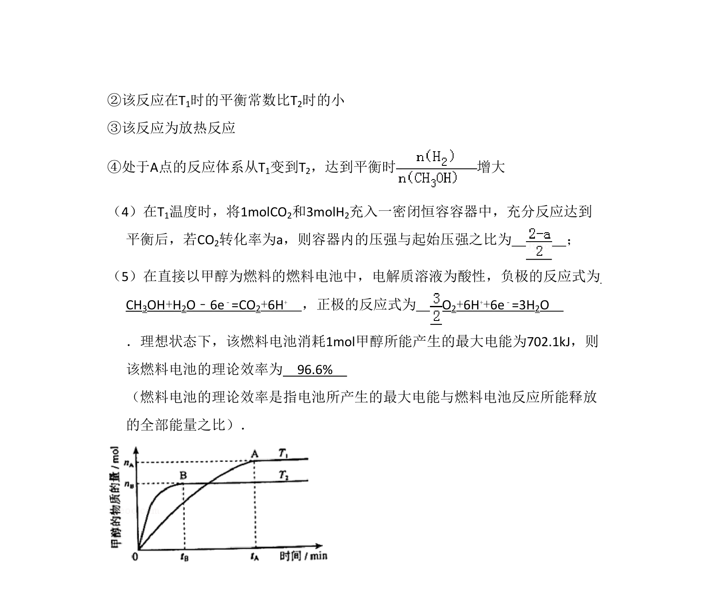
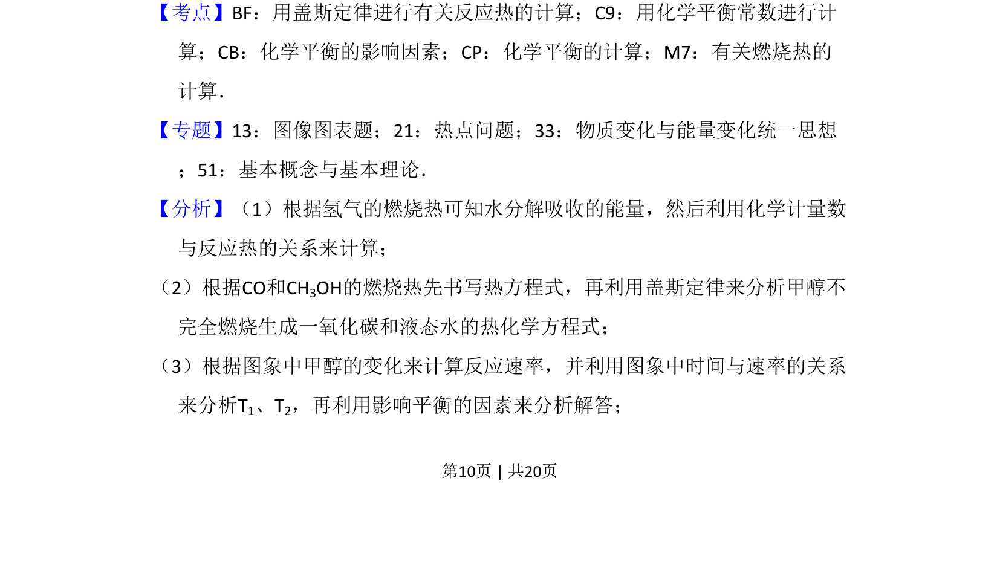
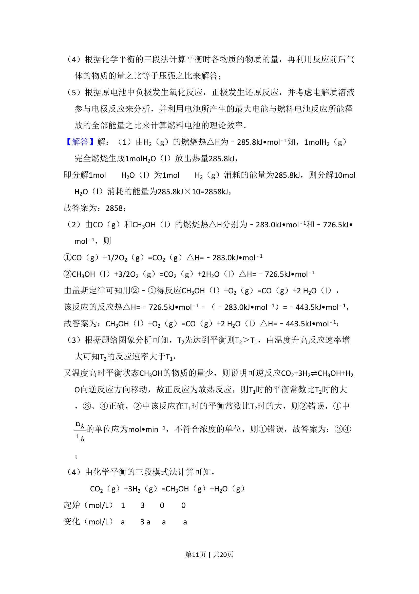
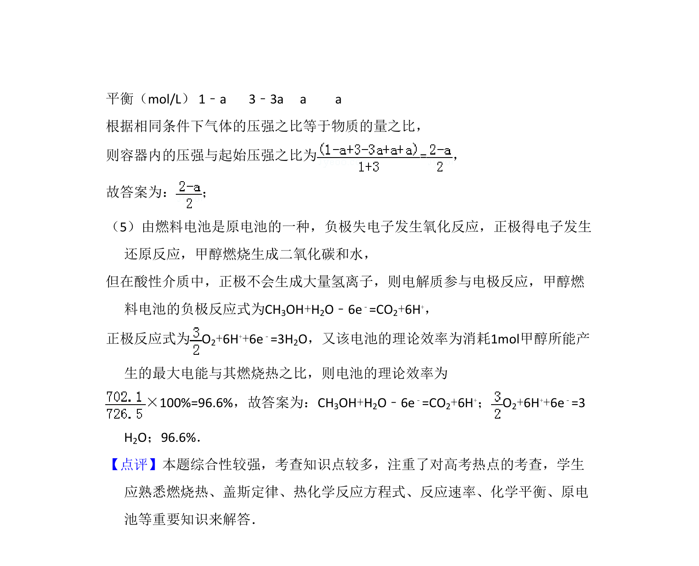

## 题面

## 摘要

本题考查反应热计算、热化学方程式书写、化学平衡速率与图像分析。

## 关联考点

- [[288-反应热|反应热]]
- [[309-热化学方程式|热化学方程式]]
- [[283-化学反应速率|化学反应速率]]
- [[617-化学平衡图像|化学平衡图像]]

## 答案与解析

> 📄 原 PDF 第 9 页：`素材/真题/吉林/2008-2024·（吉林）化学高考真题/2011年高考化学试卷（新课标）（解析卷）.pdf`
