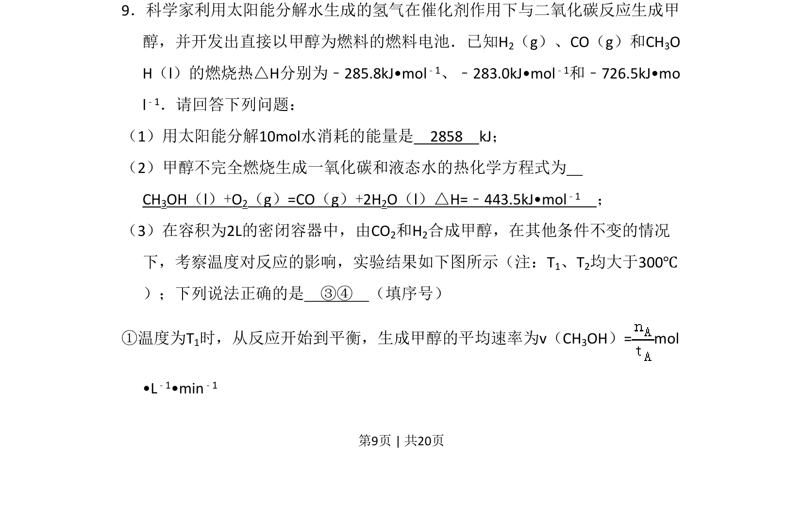
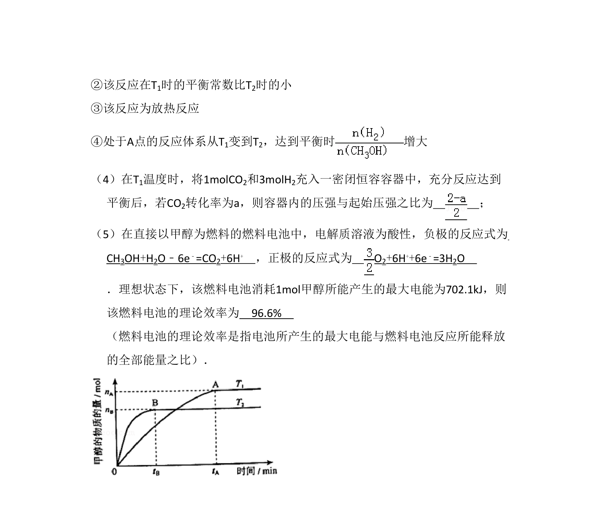
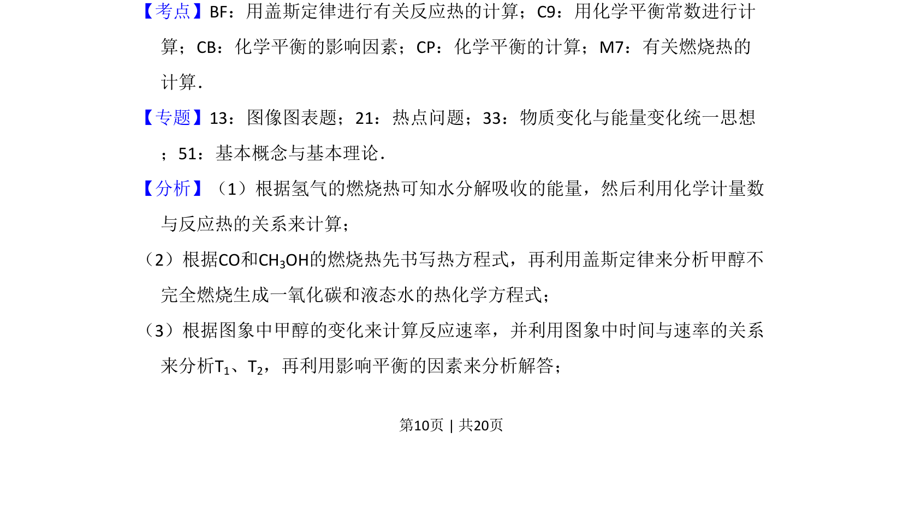
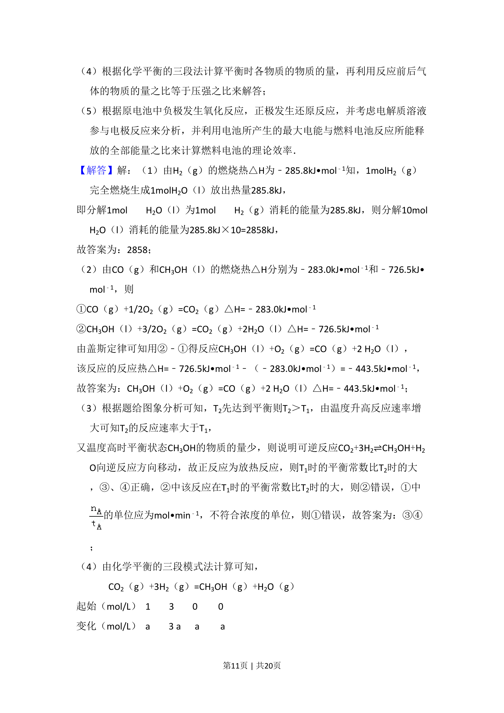
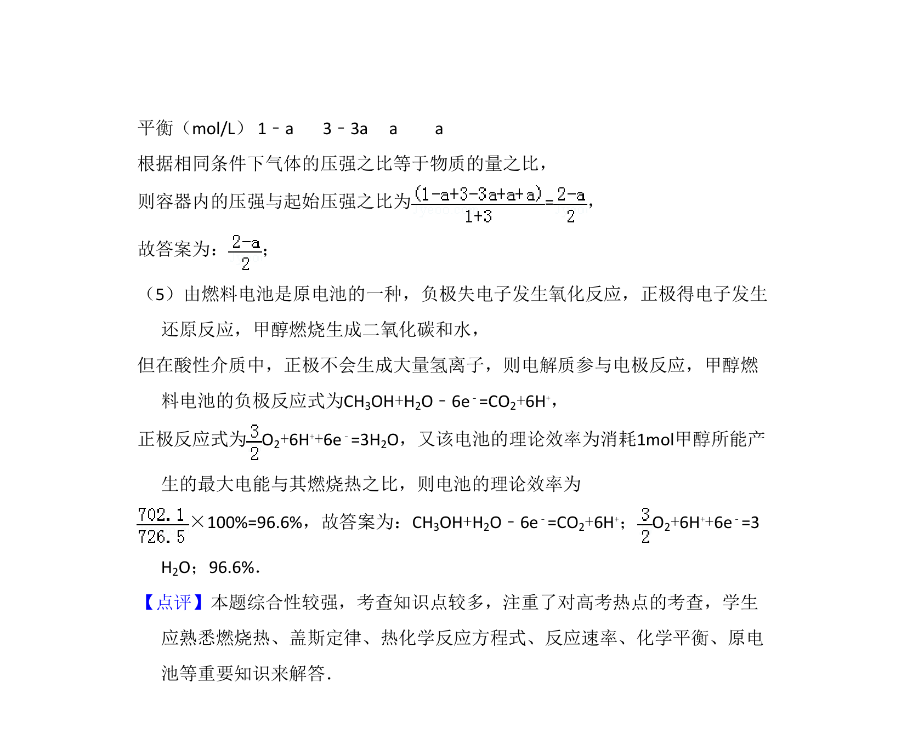

## 题面

## 摘要

本题考查反应热计算、热化学方程式书写、化学平衡速率与图像分析。

## 关联考点

- [[288-反应热|反应热]]
- [[309-热化学方程式|热化学方程式]]
- [[283-化学反应速率|化学反应速率]]
- [[617-化学平衡图像|化学平衡图像]]

## 答案与解析

> 📄 原 PDF 第 9 页：`素材/真题/吉林/2008-2024·（吉林）化学高考真题/2011年高考化学试卷（新课标）（解析卷）.pdf`

<!-- 题干文本-start -->
## 题干文本
9．科学家利用太阳能分解水生成的氢气在催化剂作用下与二氧化碳反应生成甲
醇，并开发出直接以甲醇为燃料的燃料电池．已知H2（g）、CO（g）和CH3O
H（l）的燃烧热△H分别为﹣285.8kJ•mol﹣1、﹣283.0kJ•mol﹣1和﹣726.5kJ•mo
l﹣1．请回答下列问题：
（1）用太阳能分解10mol水消耗的能量是　2858　kJ；
（2）甲醇不完全燃烧生成一氧化碳和液态水的热化学方程式为　
CH3OH（l）+O2（g）=CO（g）+2H2O（l）△H=﹣443.5kJ•mol﹣1　；
（3）在容积为2L的密闭容器中，由CO2和H2合成甲醇，在其他条件不变的情况
下，考察温度对反应的影响，实验结果如下图所示（注：T1、T2均大于300℃
）；下列说法正确的是　③④　（填序号）
①温度为T1时，从反应开始到平衡，生成甲醇的平均速率为v（CH3OH）= mol
•L﹣1•min﹣1
<!-- 题干文本-end -->

<!-- 解析文本-start -->
## 解析文本

<!-- 解析文本-end -->
