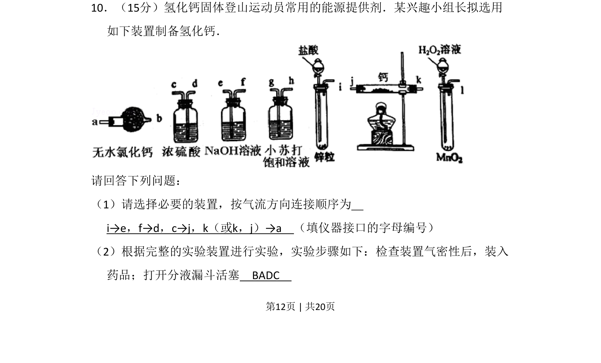
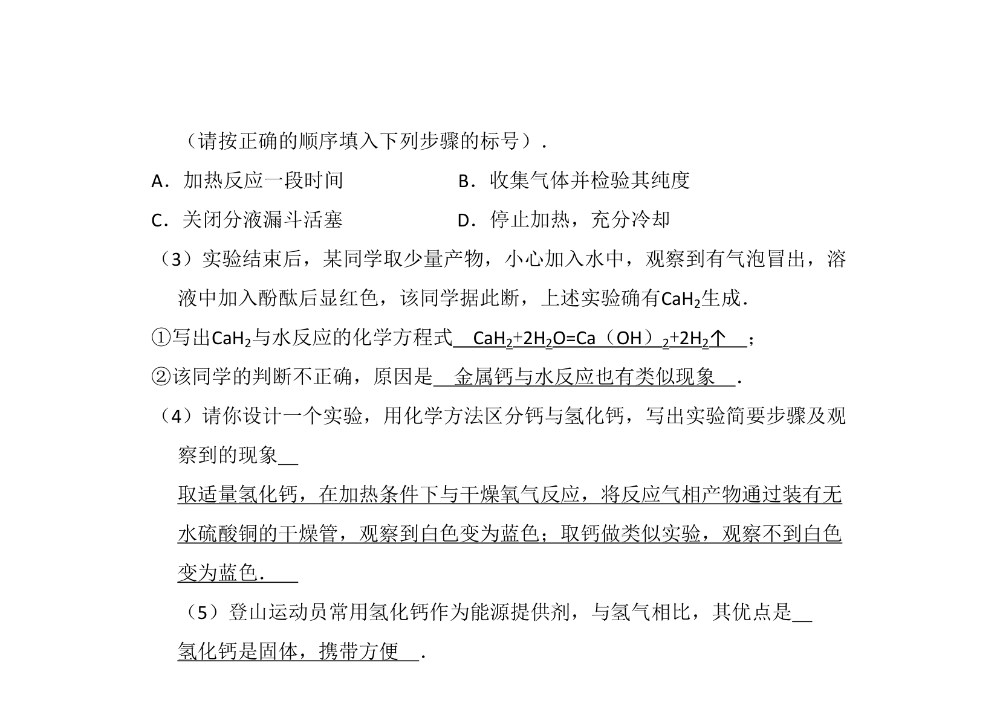
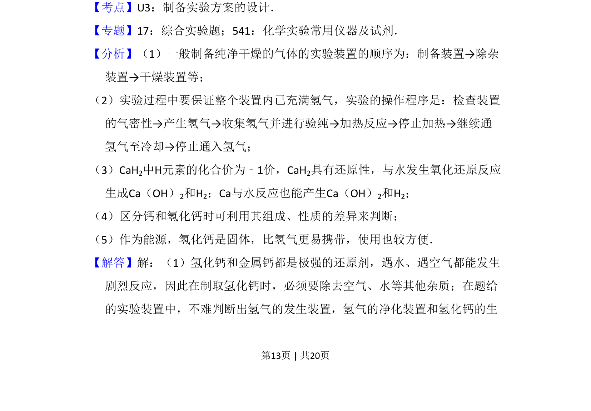
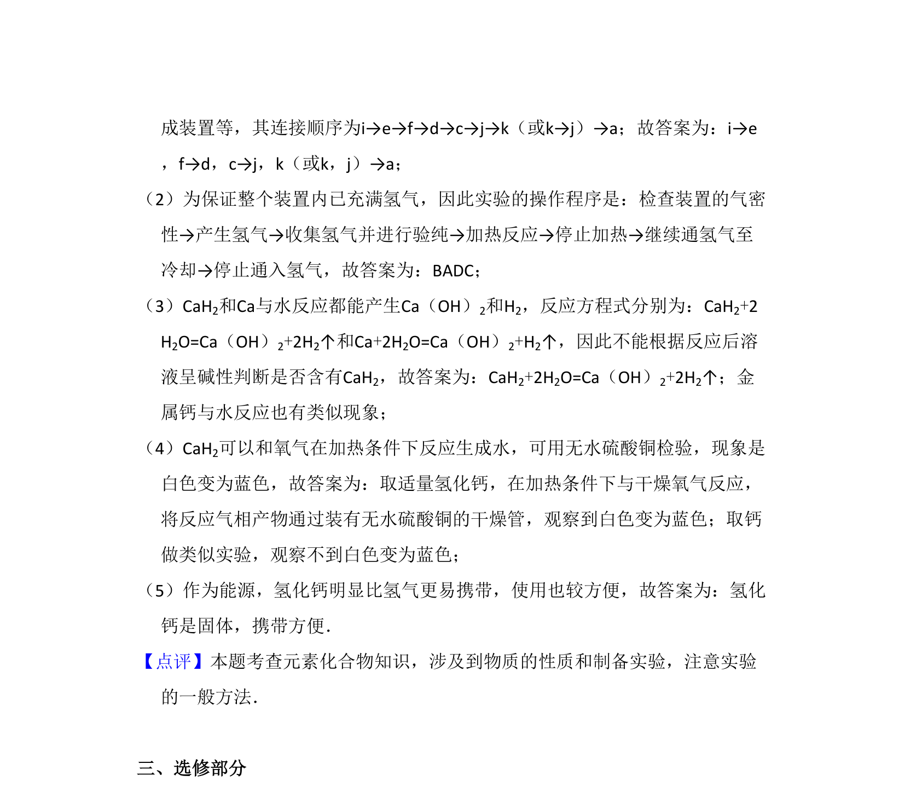

## 题面

## 摘要

制备氢化钙的实验装置连接顺序、步骤及气密性检查

## 关联考点

- [[673-实验装置连接顺序|实验装置连接顺序]]
- [[670-实验步骤与操作|实验步骤与操作]]
- [[730-气密性检查|气密性检查]]

## 答案与解析

> 📄 原 PDF 第 12 页：`素材/真题/吉林/2008-2024·（吉林）化学高考真题/2011年高考化学试卷（新课标）（解析卷）.pdf`
