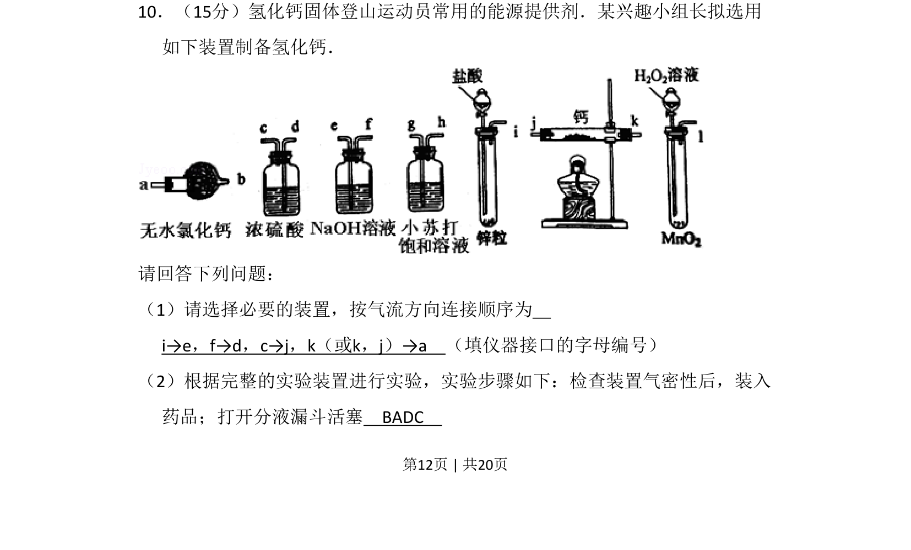
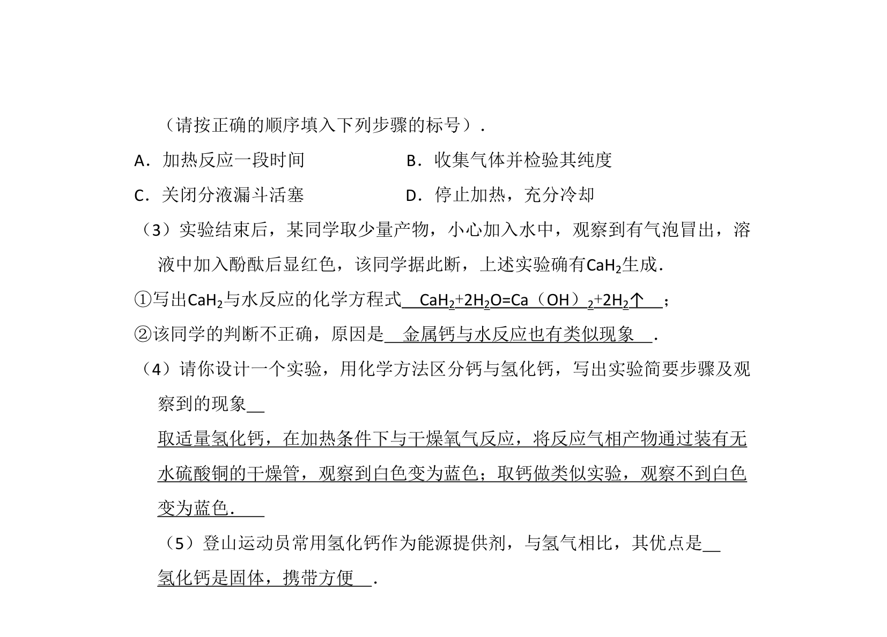
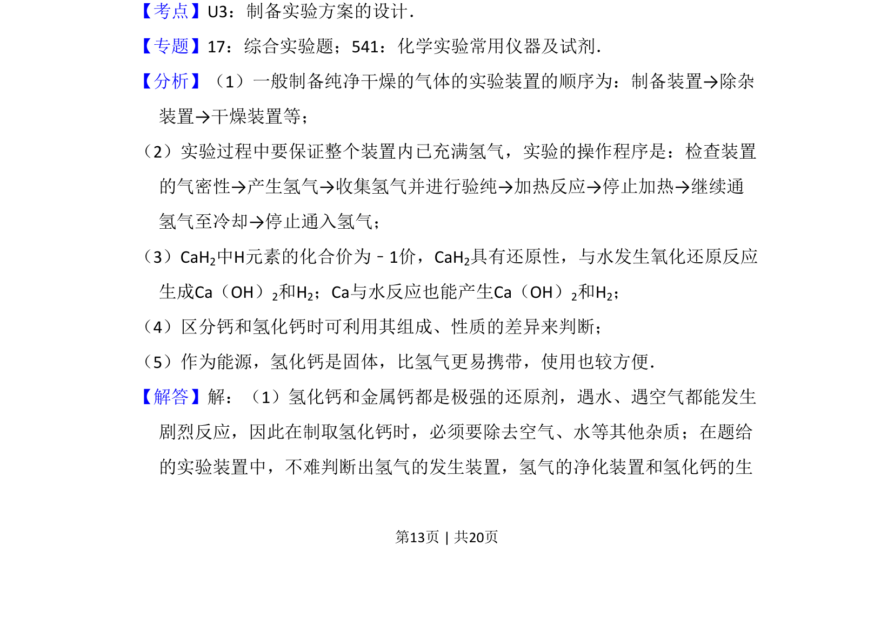
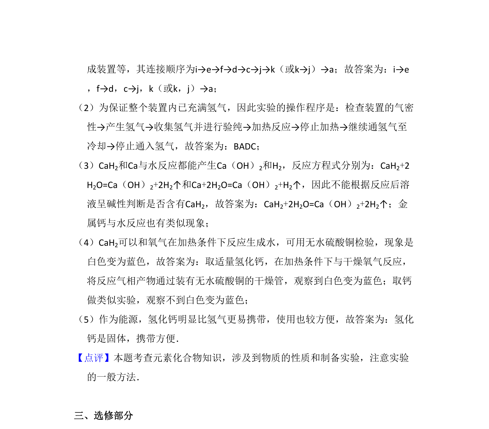

## 题面

## 摘要

制备氢化钙的实验装置连接顺序、步骤及气密性检查

## 关联考点

- [[673-实验装置连接顺序|实验装置连接顺序]]
- [[670-实验步骤与操作|实验步骤与操作]]
- [[730-气密性检查|气密性检查]]

## 答案与解析

> 📄 原 PDF 第 12 页：`素材/真题/吉林/2008-2024·（吉林）化学高考真题/2011年高考化学试卷（新课标）（解析卷）.pdf`

<!-- 题干文本-start -->
## 题干文本
10．（15分）氢化钙固体登山运动员常用的能源提供剂．某兴趣小组长拟选用
如下装置制备氢化钙．
请回答下列问题：
（1）请选择必要的装置，按气流方向连接顺序为　
i→e，f→d，c→j，k（或k，j）→a　（填仪器接口的字母编号）
（2）根据完整的实验装置进行实验，实验步骤如下：检查装置气密性后，装入
药品；打开分液漏斗活塞　BADC
<!-- 题干文本-end -->

<!-- 解析文本-start -->
## 解析文本

<!-- 解析文本-end -->
