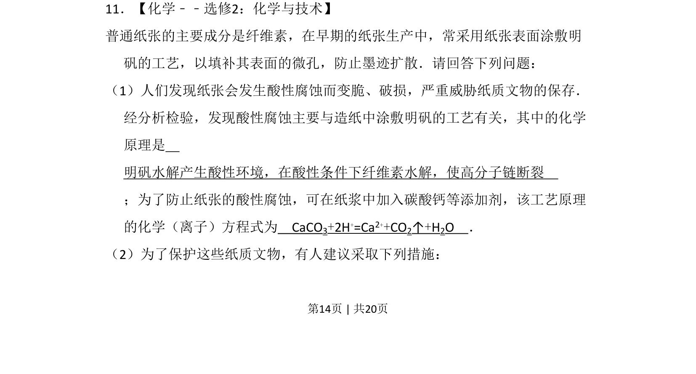
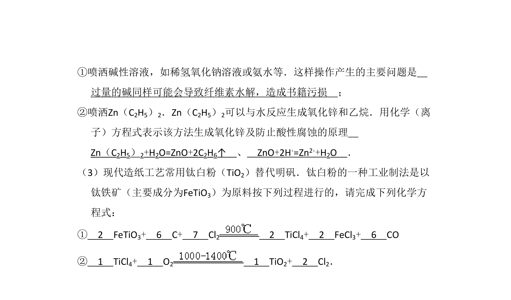
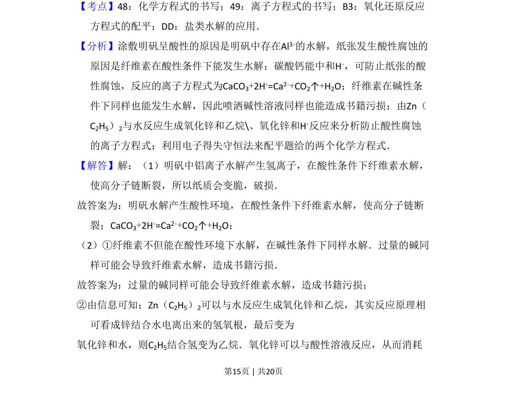
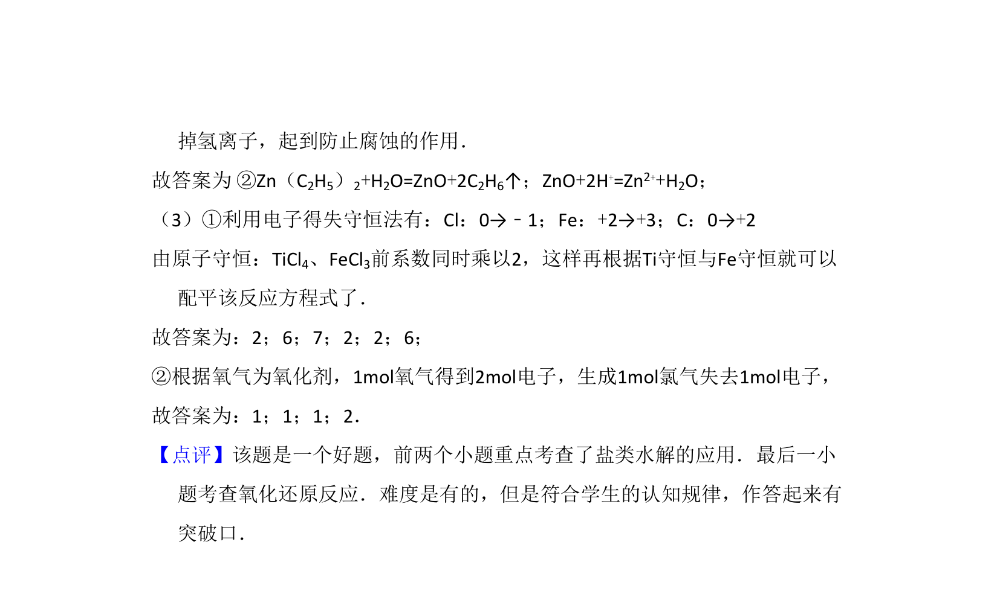

## 题面

## 摘要

该题考查明矾水解导致纸张酸性腐蚀的原理及碳酸钙防腐的化学方程式书写。

## 关联考点

- [[742-水解反应|水解反应]]
- [[565-纤维素水解|纤维素水解]]
- [[803-碳酸钙与酸反应|碳酸钙与酸反应]]
- [[170-离子方程式|离子方程式]]

## 答案与解析

> 📄 原 PDF 第 14 页：`素材/真题/吉林/2008-2024·（吉林）化学高考真题/2011年高考化学试卷（新课标）（解析卷）.pdf`

<!-- 题干文本-start -->
## 题干文本
11．【化学﹣﹣选修2：化学与技术】
普通纸张的主要成分是纤维素，在早期的纸张生产中，常采用纸张表面涂敷明
矾的工艺，以填补其表面的微孔，防止墨迹扩散．请回答下列问题：
（1）人们发现纸张会发生酸性腐蚀而变脆、破损，严重威胁纸质文物的保存．
经分析检验，发现酸性腐蚀主要与造纸中涂敷明矾的工艺有关，其中的化学
原理是　
明矾水解产生酸性环境，在酸性条件下纤维素水解，使高分子链断裂　
；为了防止纸张的酸性腐蚀，可在纸浆中加入碳酸钙等添加剂，该工艺原理
的化学（离子）方程式为　CaCO3+2H+=Ca2++CO2↑+H2O　．
（2）为了保护这些纸质文物，有人建议采取下列措施：
<!-- 题干文本-end -->

<!-- 解析文本-start -->
## 解析文本

<!-- 解析文本-end -->
