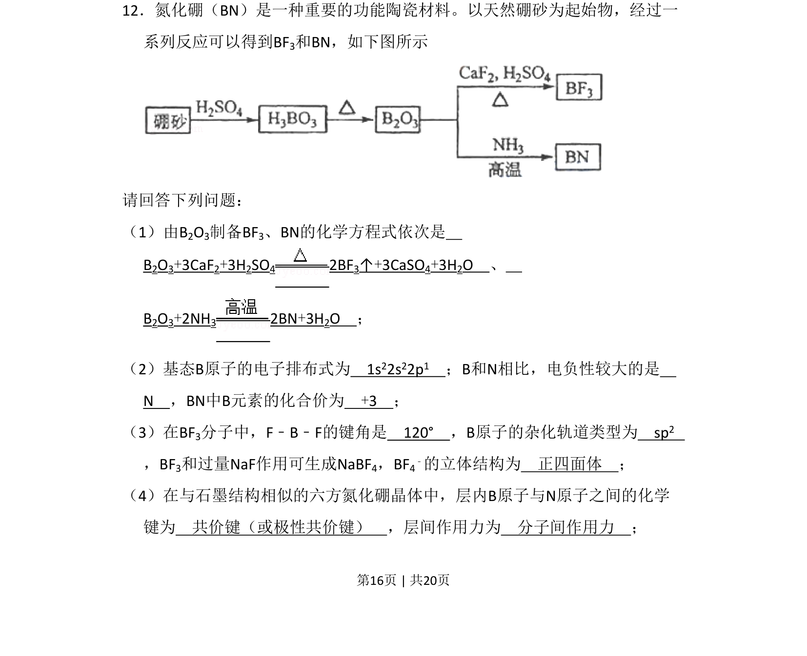
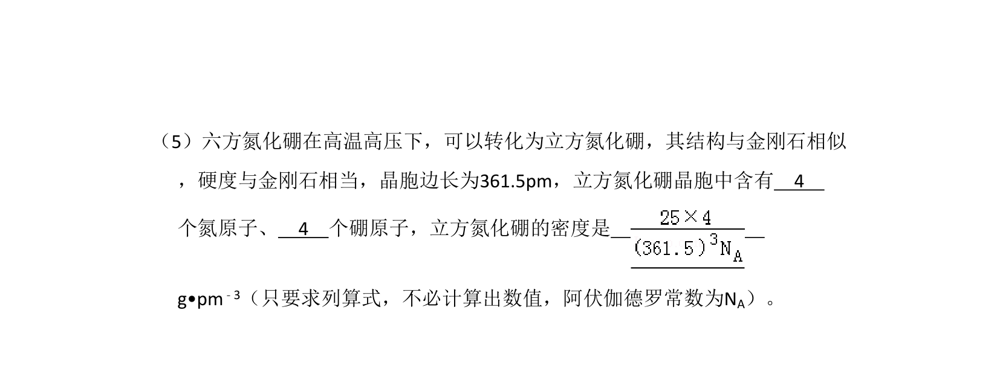
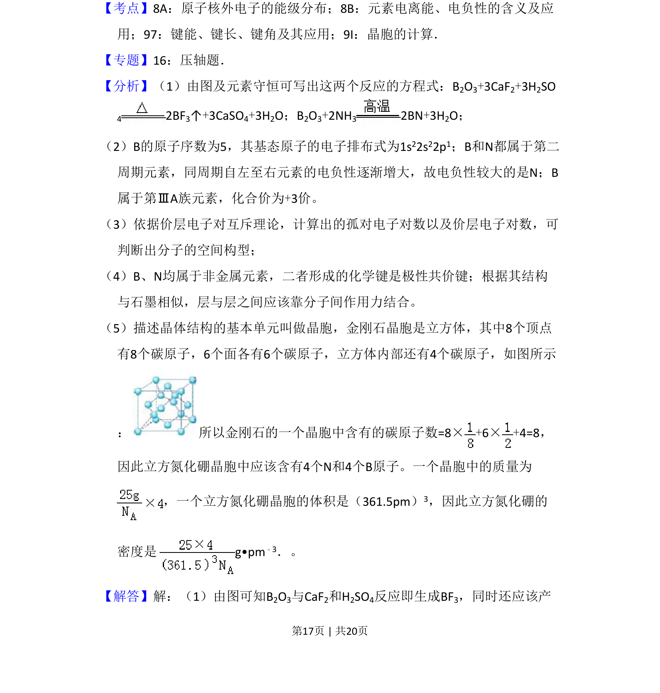
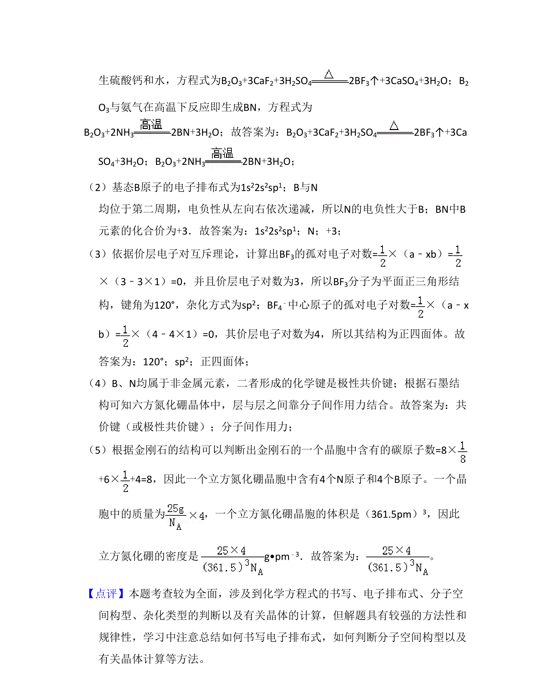

## 题面

## 摘要

以硼砂为原料制备BN和BF₃，考查物质结构与性质，包括电子排布、电负性、杂化轨道、分子空间构型及晶体结构。

## 关联考点

- [[389-电子排布式|电子排布式]]
- [[391-电负性|电负性]]
- [[433-杂化轨道理论|杂化轨道理论]]
- [[430-分子空间构型|分子空间构型]]
- [[632-化学键类型|化学键类型]]

## 答案与解析

> 📄 原 PDF 第 16 页：`素材/真题/吉林/2008-2024·（吉林）化学高考真题/2011年高考化学试卷（新课标）（解析卷）.pdf`
