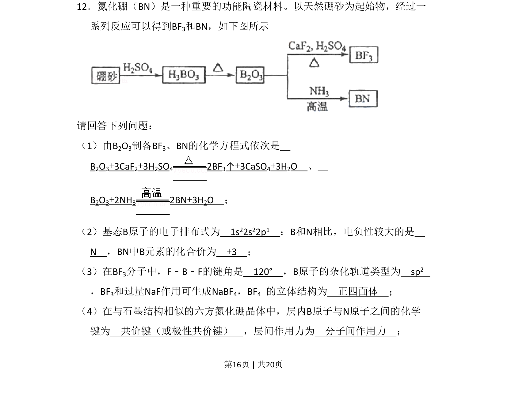
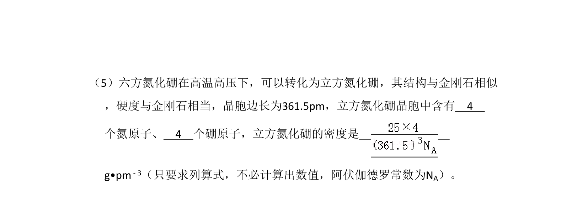
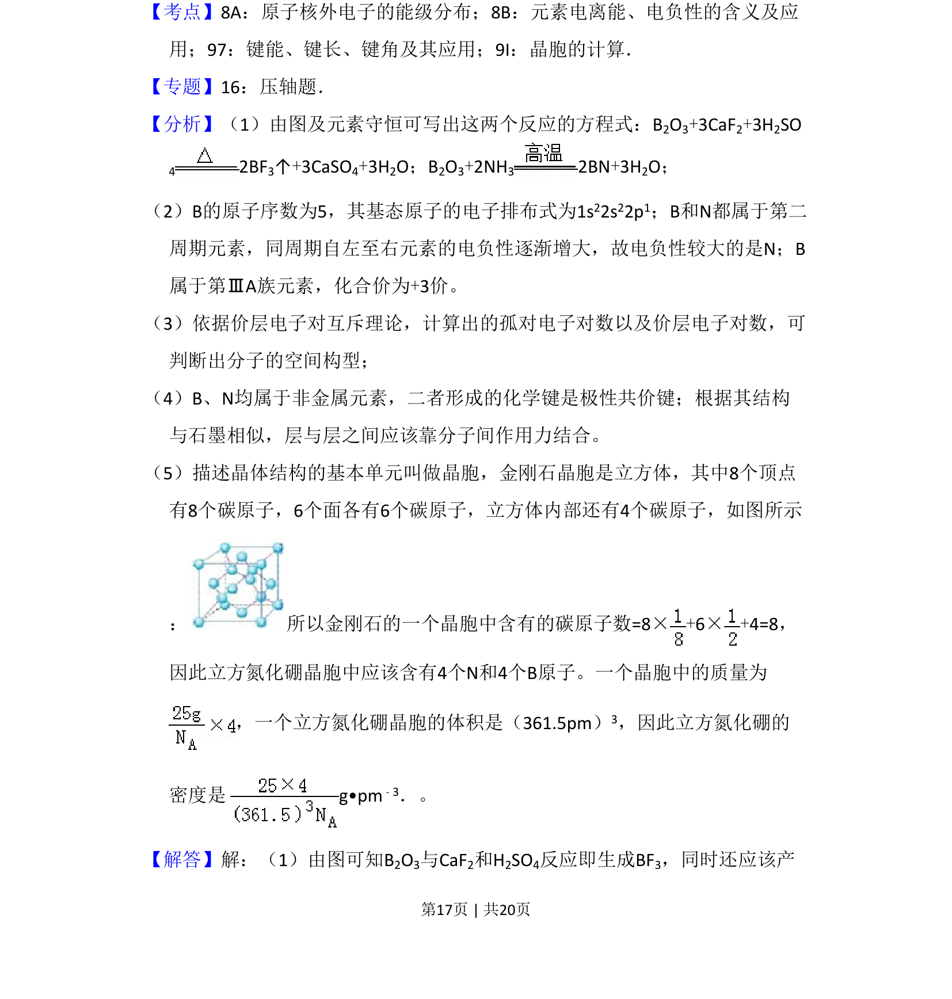
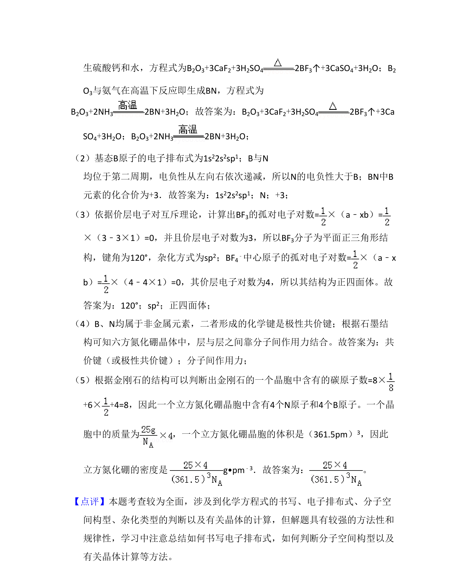

## 题面

## 摘要

以硼砂为原料制备BN和BF₃，考查物质结构与性质，包括电子排布、电负性、杂化轨道、分子空间构型及晶体结构。

## 关联考点

- [[389-电子排布式|电子排布式]]
- [[391-电负性|电负性]]
- [[433-杂化轨道理论|杂化轨道理论]]
- [[430-分子空间构型|分子空间构型]]
- [[631-化学键类型|化学键类型]]

## 答案与解析

> 📄 原 PDF 第 16 页：`素材/真题/吉林/2008-2024·（吉林）化学高考真题/2011年高考化学试卷（新课标）（解析卷）.pdf`

<!-- 题干文本-start -->
## 题干文本
12．氮化硼（BN）是一种重要的功能陶瓷材料。以天然硼砂为起始物，经过一
系列反应可以得到BF3和BN，如下图所示
请回答下列问题：
（1）由B2O3制备BF3、BN的化学方程式依次是　
B2O3+3CaF2+3H2SO4 2BF3↑+3CaSO4+3H2O　、　
B2O3+2NH3 2BN+3H2O　；
（2）基态B原子的电子排布式为　1s22s22p1　；B和N相比，电负性较大的是　
N　，BN中B元素的化合价为　+3　；
（3）在BF3分子中，F﹣B﹣F的键角是　120°　，B原子的杂化轨道类型为　sp2　
，BF3和过量NaF作用可生成NaBF4，BF4
﹣的立体结构为　正四面体　；
（4）在与石墨结构相似的六方氮化硼晶体中，层内B原子与N原子之间的化学
键为　共价键（或极性共价键）　，层间作用力为　分子间作用力　；
<!-- 题干文本-end -->

<!-- 解析文本-start -->
## 解析文本

<!-- 解析文本-end -->
