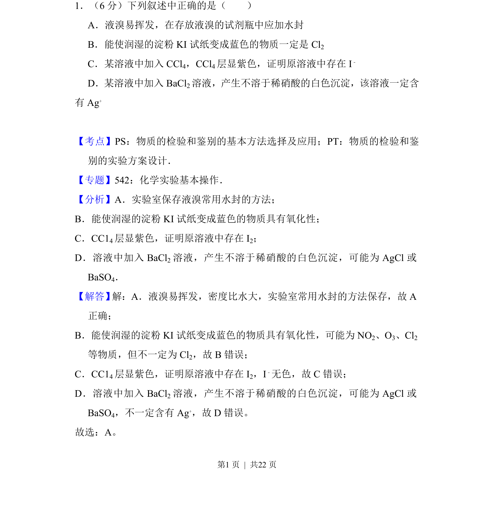
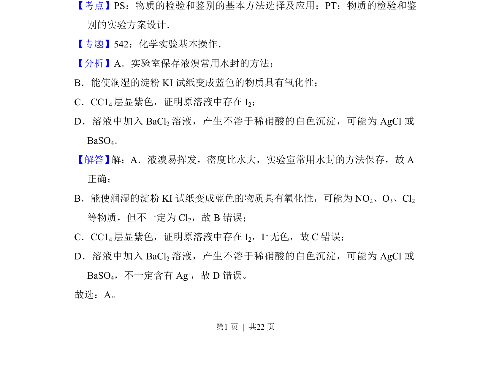

## 题面

## 摘要

该题考查常见物质的保存方法及离子检验的正误判断，涉及液溴保存和物质鉴别。

## 关联考点

- [[778-物质的检验与鉴别|物质的检验与鉴别]]
- [[668-实验方案设计|实验方案设计]]
- [[837-试剂保存|试剂保存]]

## 答案与解析

> 📄 原 PDF 第 1 页：`素材/真题/吉林/2008-2024·（吉林）化学高考真题/2012年高考化学试卷（新课标）（解析卷）.pdf`
