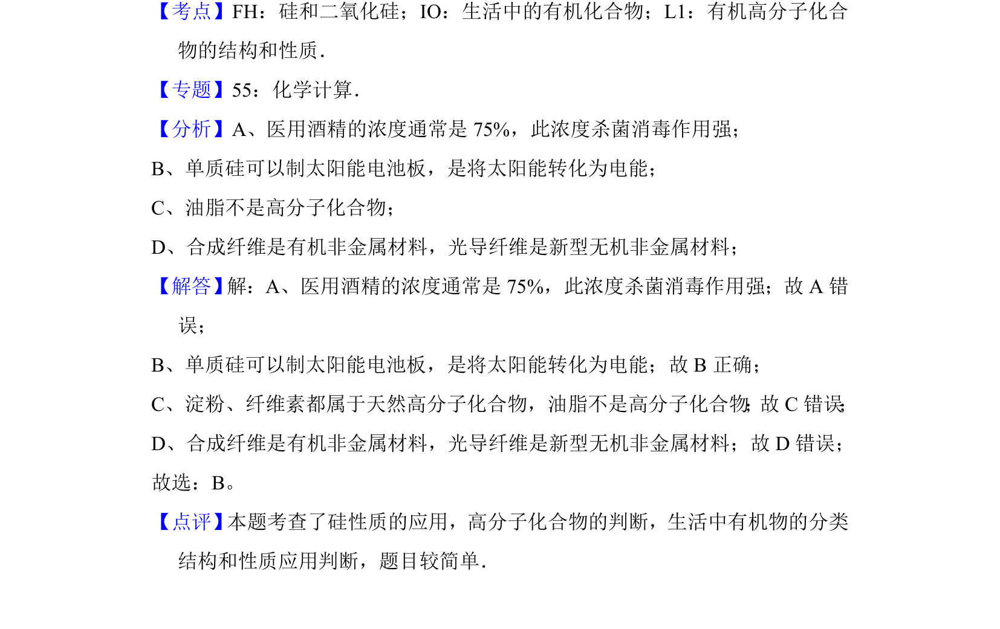

## 题面

## 摘要

本题考查硅的性质、高分子化合物判断及常见有机物分类与应用。

## 关联考点

- [[799-硅和二氧化硅|硅和二氧化硅]]
- [[716-有机高分子化合物|有机高分子化合物]]
- [[558-生活中的有机物|生活中的有机物]]

## 答案与解析

> 📄 原 PDF 第 2 页：`素材/真题/吉林/2008-2024·（吉林）化学高考真题/2012年高考化学试卷（新课标）（解析卷）.pdf`
