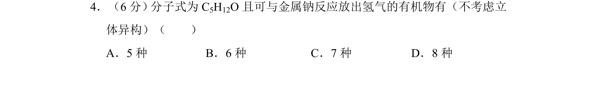
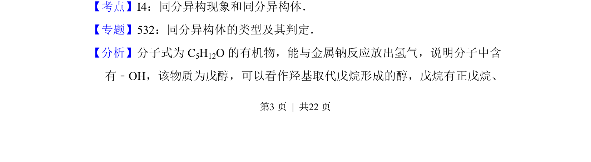

## 题面

## 摘要

分子式为C5H12O的醇类同分异构体数目判断，涉及碳链异构与羟基位置异构。

## 关联考点

- [[446-同分异构体|同分异构体]]
- [[戊烷]]
- [[羟基取代]]
- [[立体异构排除]]

## 答案与解析

> 📄 原 PDF 第 3 页：`素材/真题/吉林/2008-2024·（吉林）化学高考真题/2012年高考化学试卷（新课标）（解析卷）.pdf`
