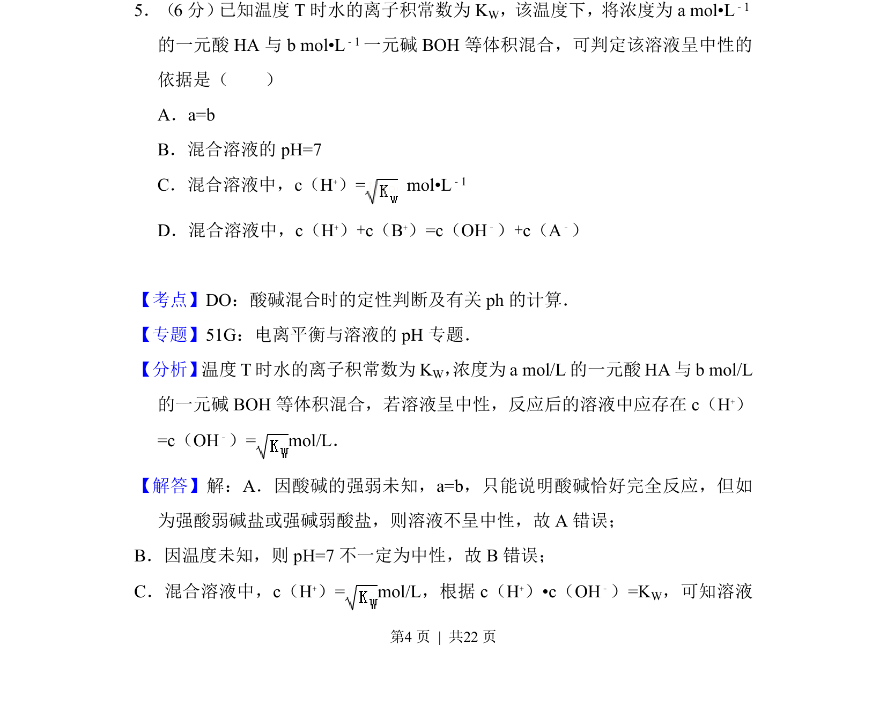
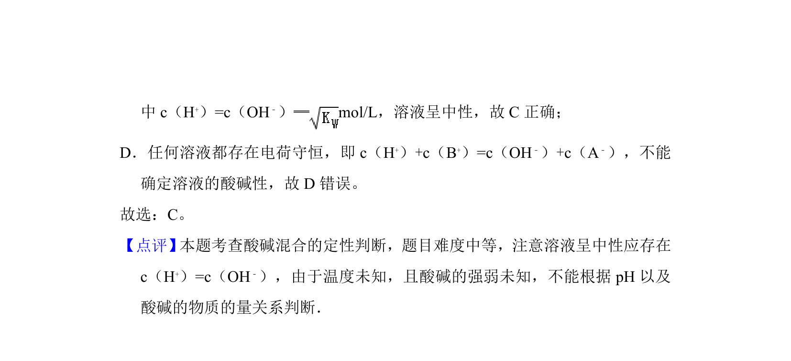

## 题面

## 摘要

该题通过水的离子积常数判断酸碱等体积混合后溶液呈中性的条件。

## 关联考点

- [[水的离子积常数]]
- [[酸碱混合定性判断]]
- [[316-pH计算|pH计算]]
- [[溶液中离子浓度关系]]

## 答案与解析

> 📄 原 PDF 第 4 页：`素材/真题/吉林/2008-2024·（吉林）化学高考真题/2012年高考化学试卷（新课标）（解析卷）.pdf`
