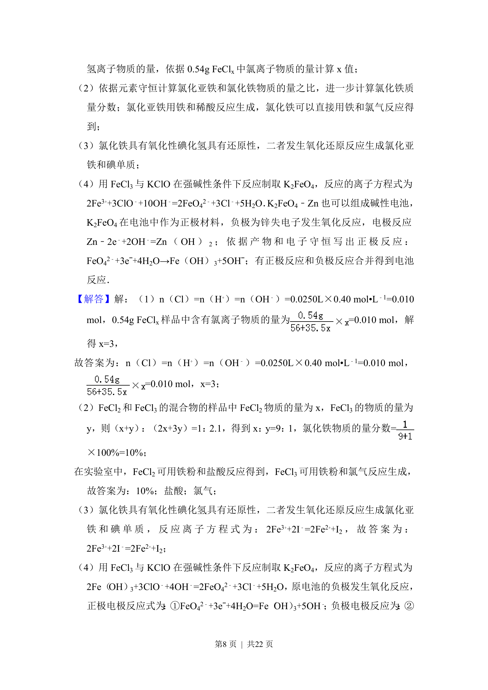

## 题面

## 摘要

考查铁及其化合物的计算、制备、离子反应与电化学综合应用。

## 关联考点

- [[622-化学方程式的有关计算|化学方程式的有关计算]]
- [[532-原电池和电解池的工作原理|原电池和电解池的工作原理]]
- [[574-铁的化合物|铁的化合物]]
- [[807-离子方程式的书写|离子方程式的书写]]

## 答案与解析

> 📄 原 PDF 第 7 页：`素材/真题/吉林/2008-2024·（吉林）化学高考真题/2012年高考化学试卷（新课标）（解析卷）.pdf`
