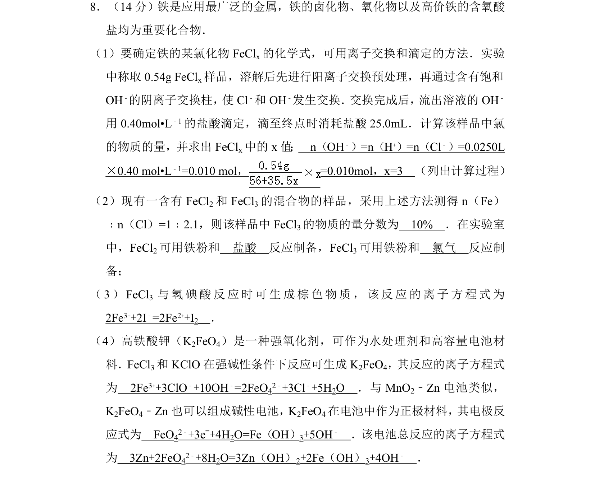
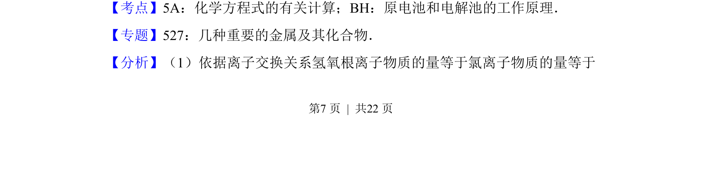
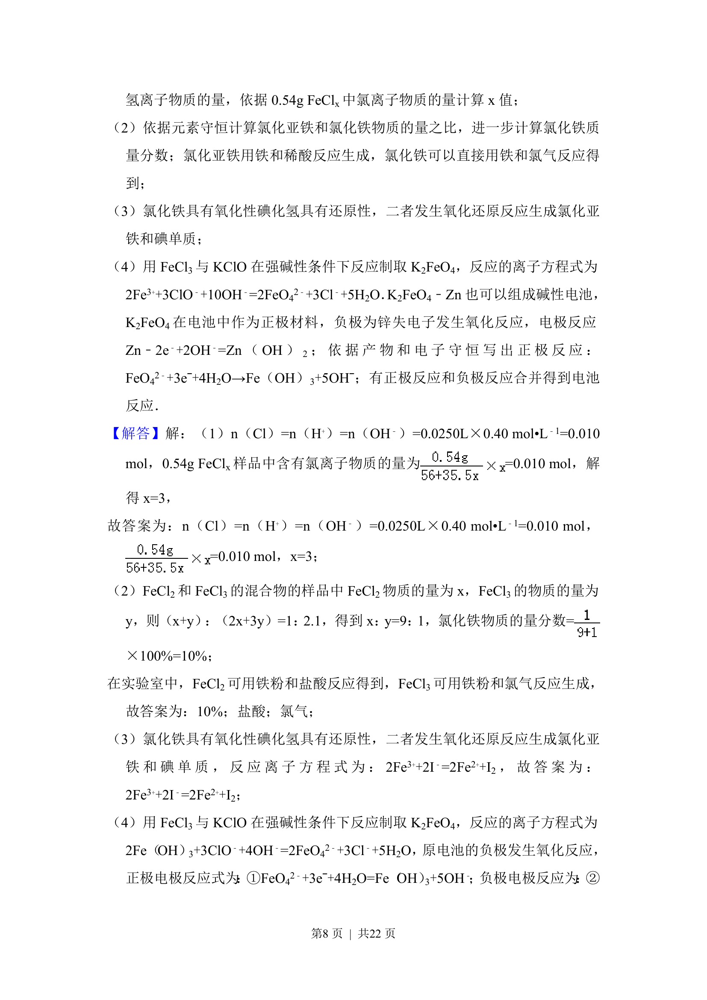
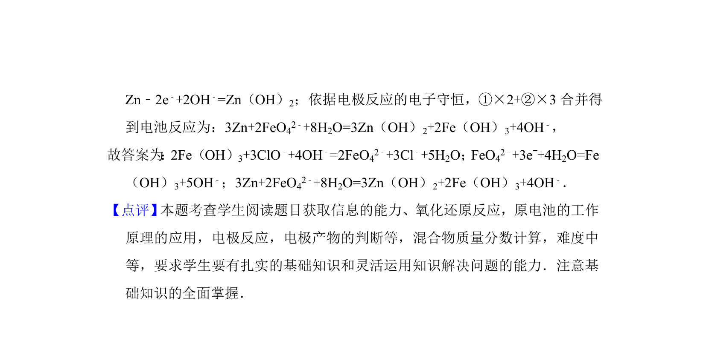

## 题面

## 摘要

考查铁及其化合物的计算、制备、离子反应与电化学综合应用。

## 关联考点

- [[622-化学方程式的有关计算|化学方程式的有关计算]]
- [[532-原电池和电解池的工作原理|原电池和电解池的工作原理]]
- [[574-铁的化合物|铁的化合物]]
- [[807-离子方程式的书写|离子方程式的书写]]

## 答案与解析

> 📄 原 PDF 第 7 页：`素材/真题/吉林/2008-2024·（吉林）化学高考真题/2012年高考化学试卷（新课标）（解析卷）.pdf`

<!-- 题干文本-start -->
## 题干文本
8．（14分）铁是应用最广泛的金属，铁的卤化物、氧化物以及高价铁的含氧酸
盐均为重要化合物．
（1）要确定铁的某氯化物FeCl x的化学式，可用离子交换和滴定的方法．实验
中称取0.54g FeCl x样品，溶解后先进行阳离子交换预处理，再通过含有饱和
OH﹣的阴离子交换柱， 使Cl﹣和OH ﹣发生交换． 交换完成后， 流出溶液的OH﹣
用0.40mol•L ﹣1的盐酸滴定，滴至终点时消耗盐酸25.0mL．计算该样品中氯
的物质的量，并求出FeCl x中的x值 ： 　n（OH﹣）=n（H+）=n（Cl﹣）=0.0250L
×0.40 mol•L﹣1=0.010 mol， =0.010mol，x=3　（列出计算过程）
（2）现有一含有FeCl 2和FeCl 3的混合物的样品，采用上述方法测得n（Fe）
﹕n（Cl）=1﹕2.1，则该样品中FeCl 3的物质的量分数为　10%　．在实验室
中，FeCl2可用铁粉和　盐酸　反应制备，FeCl 3可用铁粉和　氯气　反应制
备；
（3）FeCl 3 与氢碘酸反应时可生成棕色物质，该反应的离子方程式为　
2Fe3++2I﹣=2Fe2++I2　．
（4）高铁酸钾（K 2FeO4）是一种强氧化剂，可作为水处理剂和高容量电池材
料．FeCl3和KClO在强碱性条件下反应可生成K 2FeO4，其反应的离子方程式
为　2Fe3++3ClO﹣+10OH﹣=2FeO42﹣+3Cl﹣+5H2O　．与MnO 2﹣Zn电池类似，
K2FeO4﹣Zn也可以组成碱性电池，K2FeO4在电池中作为正极材料，其电极反
应式为　FeO42﹣+3eˉ+4H2O=Fe（OH）3+5OH﹣　．该电池总反应的离子方程式
为　3Zn+2FeO42﹣+8H2O=3Zn（OH）2+2Fe（OH）3+4OH﹣　．
<!-- 题干文本-end -->

<!-- 解析文本-start -->
## 解析文本
【考点】5A：化学方程式的有关计算；BH：原电池和电解池的工作原理．菁优网版权所有
【专题】527：几种重要的金属及其化合物．
【分析】（1）依据离子交换关系氢氧根离子物质的量等于氯离子物质的量等于
<!-- 解析文本-end -->
