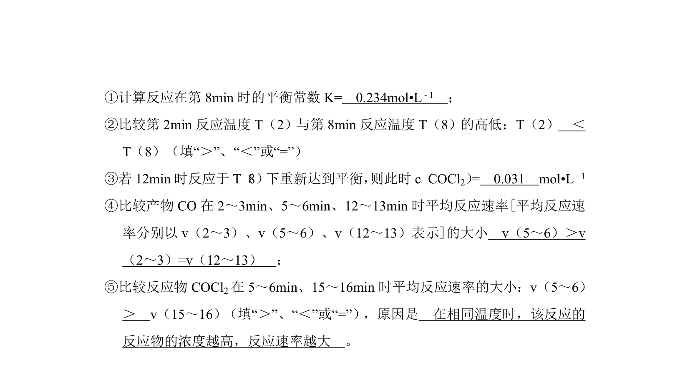
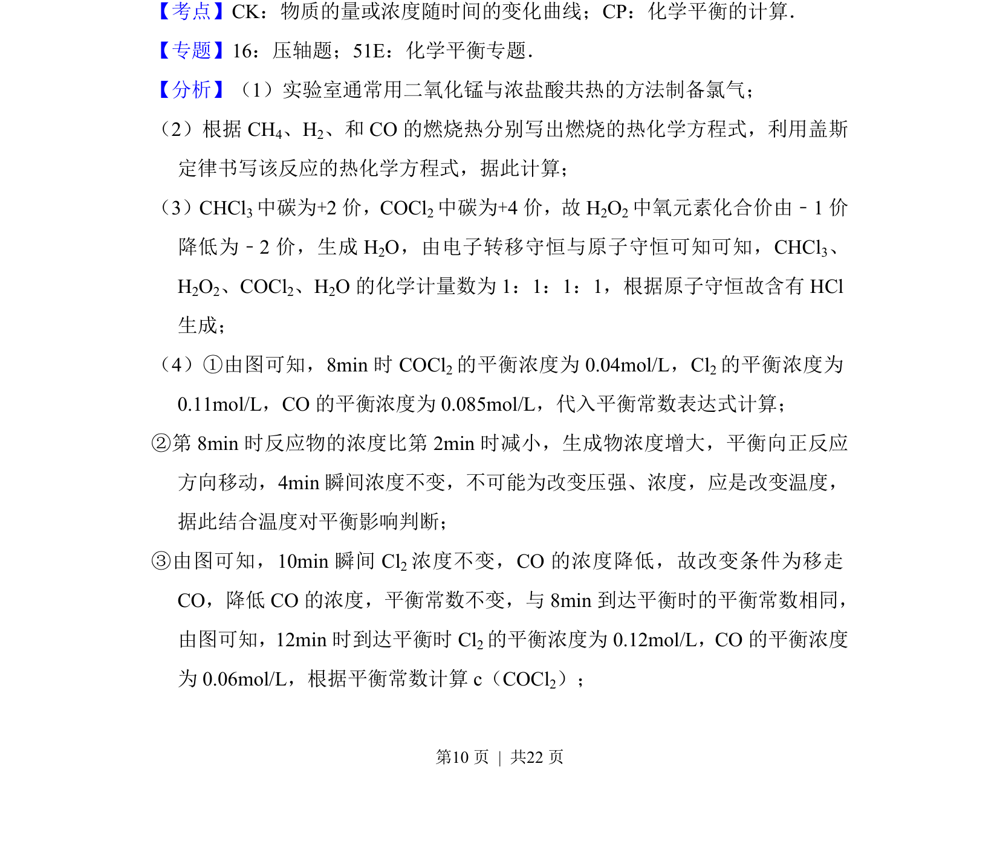
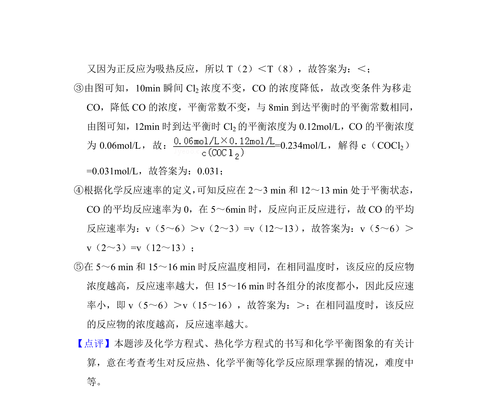

## 题面

## 摘要

考查光气的合成与分解，涵盖氯气制备、热化学计算、有机反应书写和平衡图像分析。

## 关联考点

- [[氯气实验室制备]]
- [[热化学方程式计算]]
- [[有机氧化反应]]
- [[化学平衡图像分析]]

## 答案与解析

> 📄 原 PDF 第 9 页：`素材/真题/吉林/2008-2024·（吉林）化学高考真题/2012年高考化学试卷（新课标）（解析卷）.pdf`
