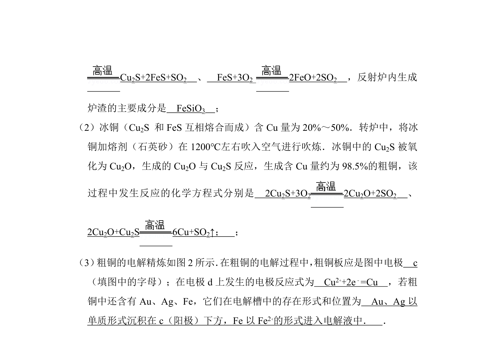
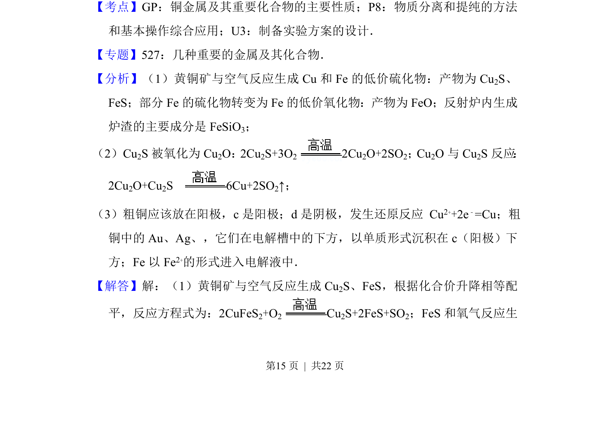

## 题面

## 摘要

黄铜矿高温氧化反应及炼铜流程化学方程式书写

## 关联考点

- [[622-化学方程式书写|化学方程式书写]]
- [[162-氧化还原反应|氧化还原反应]]
- [[579-黄铜矿|黄铜矿]]
- [[767-炼铜工艺流程|炼铜工艺流程]]

## 答案与解析

> 📄 原 PDF 第 14 页：`素材/真题/吉林/2008-2024·（吉林）化学高考真题/2012年高考化学试卷（新课标）（解析卷）.pdf`
