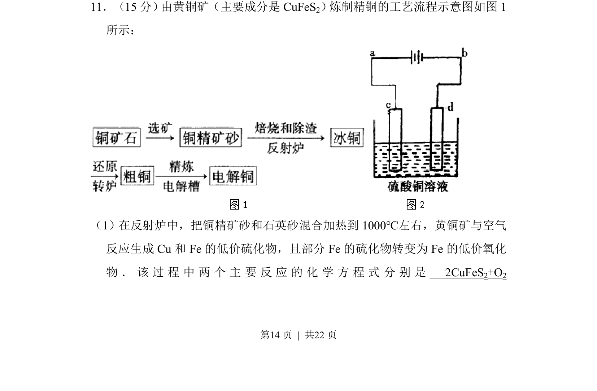
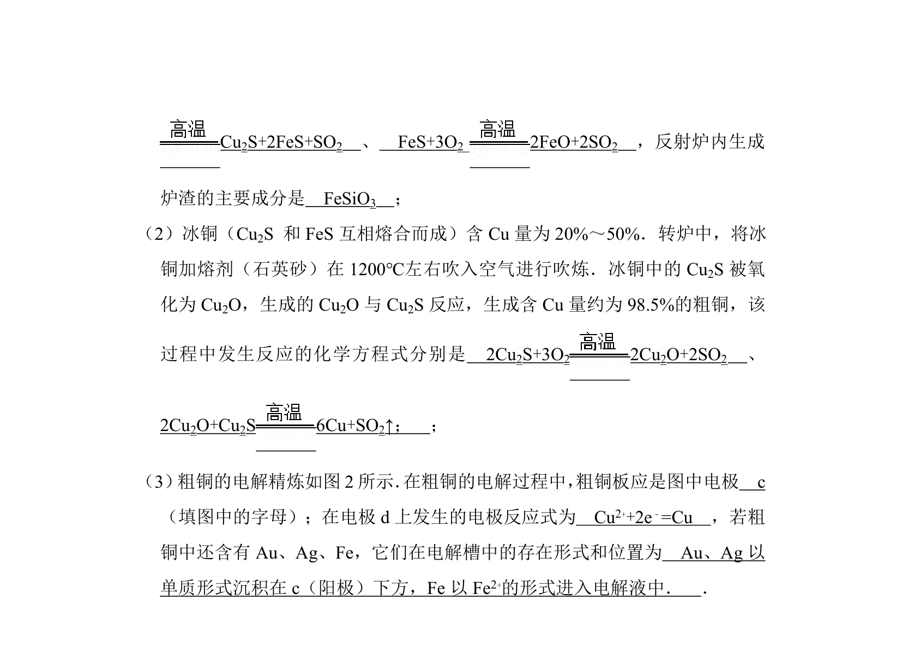
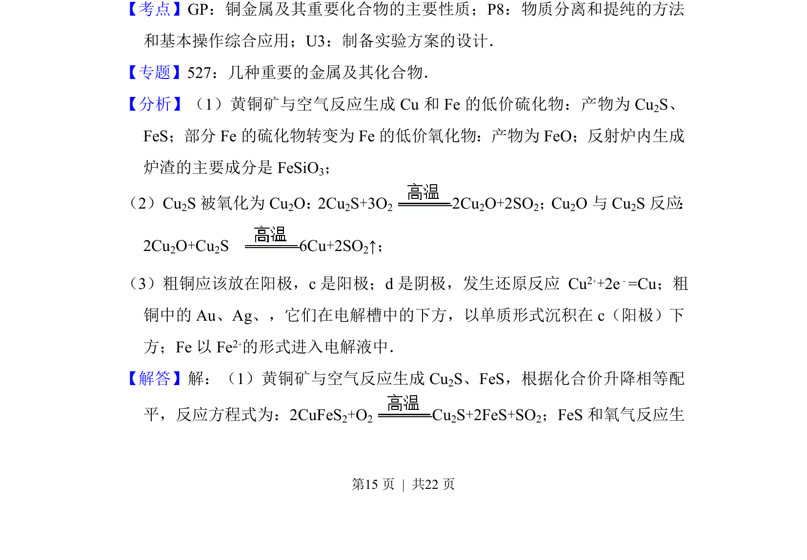
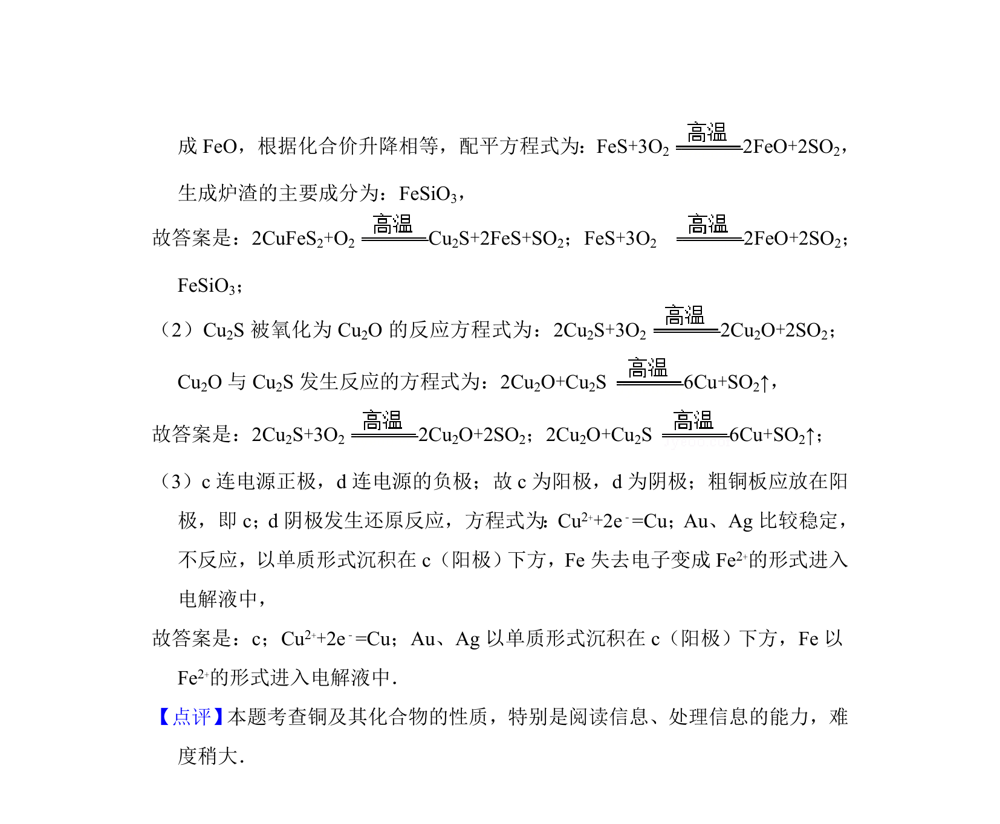

## 题面

## 摘要

黄铜矿高温氧化反应及炼铜流程化学方程式书写

## 关联考点

- [[976-化学方程式的书写|化学方程式书写]]
- [[162-氧化还原反应|氧化还原反应]]
- [[578-黄铜矿|黄铜矿]]
- [[766-炼铜工艺流程|炼铜工艺流程]]

## 答案与解析

> 📄 原 PDF 第 14 页：`素材/真题/吉林/2008-2024·（吉林）化学高考真题/2012年高考化学试卷（新课标）（解析卷）.pdf`

<!-- 题干文本-start -->
## 题干文本
11．（15分） 由黄铜矿（主要成分是CuFeS2） 炼制精铜的工艺流程示意图如图1
所示：
（1）在反射炉中，把铜精矿砂和石英砂混合加热到1000℃左右，黄铜矿与空气
反应生成Cu和Fe的低价硫化物，且部分Fe的硫化物转变为Fe的低价氧化
物 ． 该 过 程 中 两 个 主 要 反 应 的 化 学 方 程 式 分 别 是 　2CuFeS2+O2
<!-- 题干文本-end -->

<!-- 解析文本-start -->
## 解析文本

<!-- 解析文本-end -->
