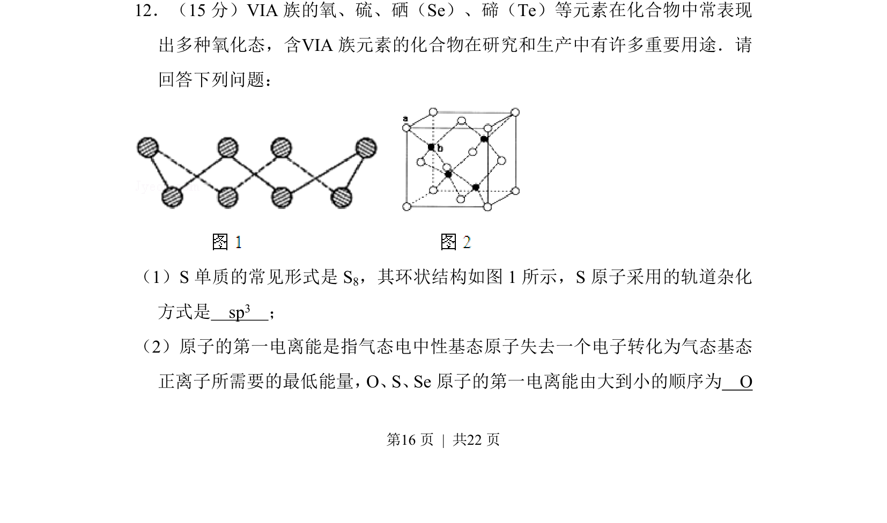
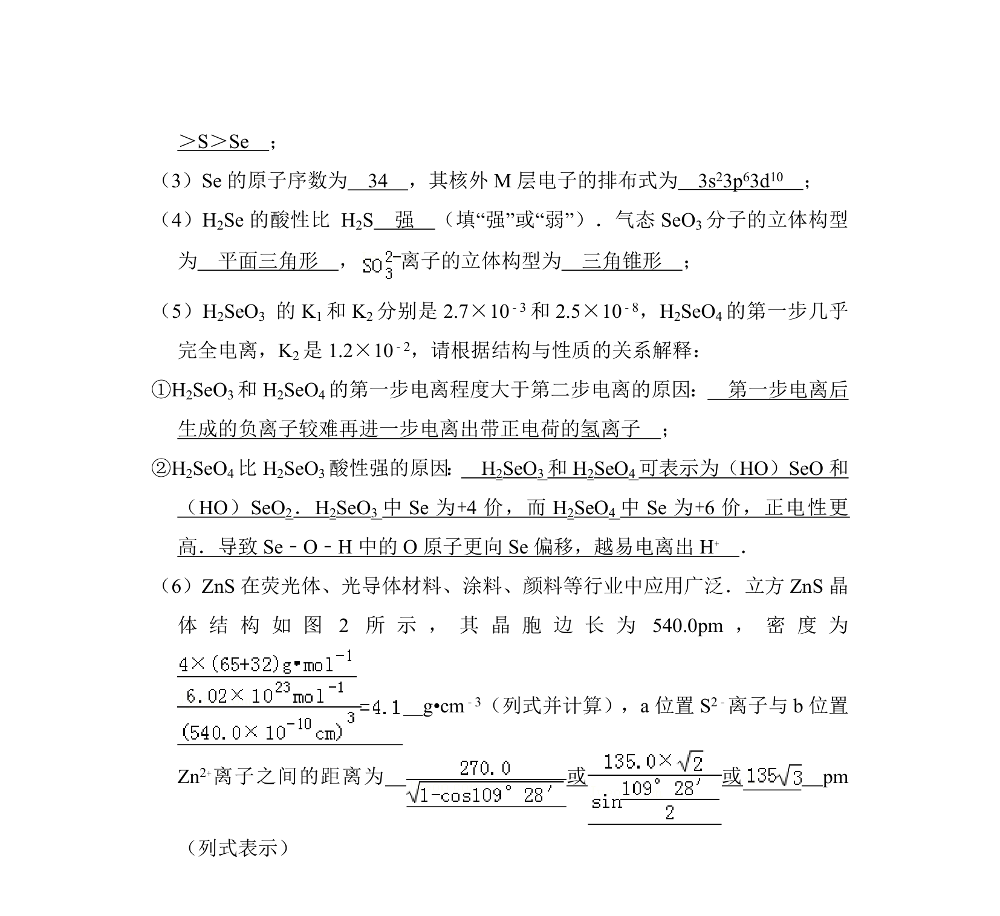
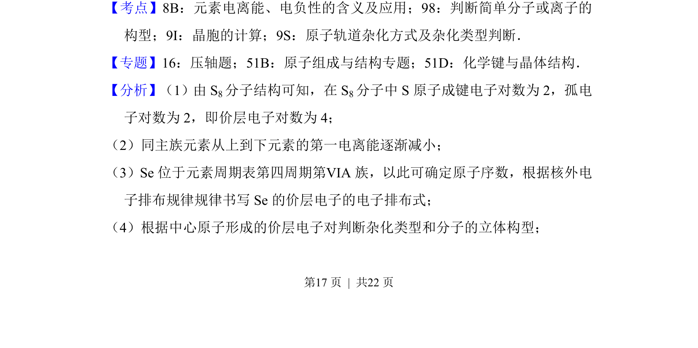
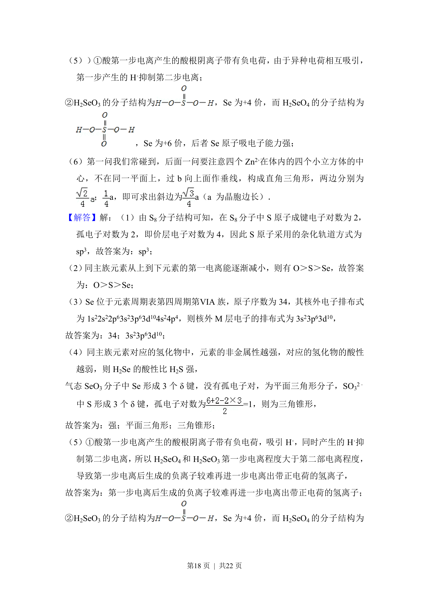
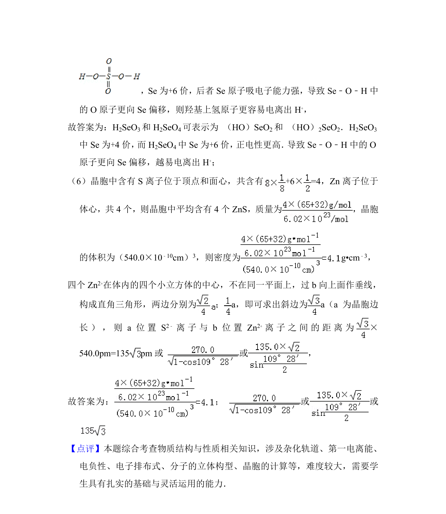

## 题面

## 摘要

考查S₈中S原子的杂化方式以及O、S、Se第一电离能大小比较

## 关联考点

- [[640-原子轨道杂化方式|原子轨道杂化方式]]
- [[393-第一电离能|第一电离能]]
- [[252-元素周期律|元素周期律]]

## 答案与解析

> 📄 原 PDF 第 16 页：`素材/真题/吉林/2008-2024·（吉林）化学高考真题/2012年高考化学试卷（新课标）（解析卷）.pdf`
