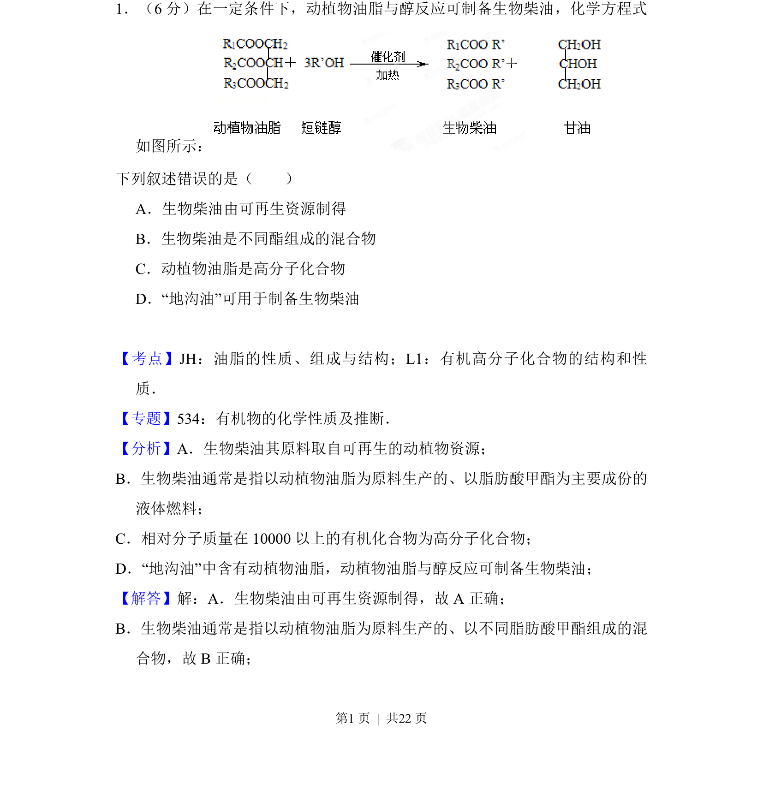
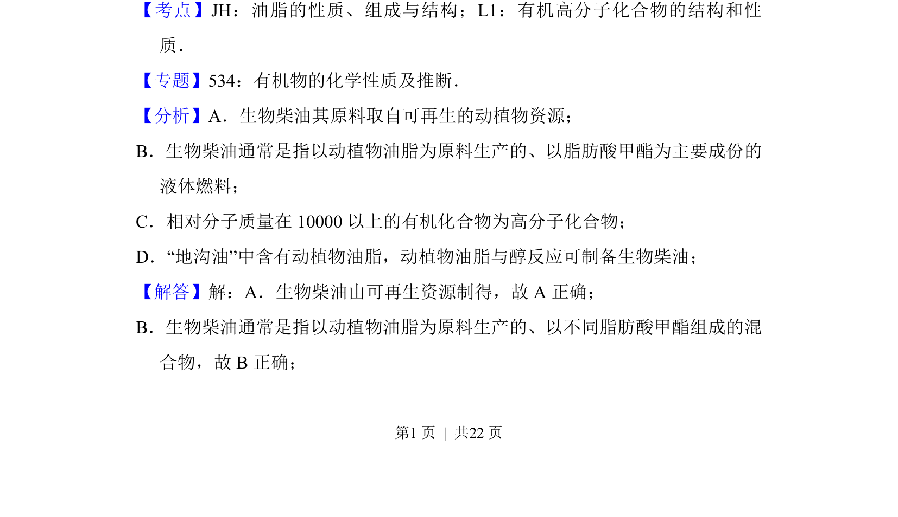
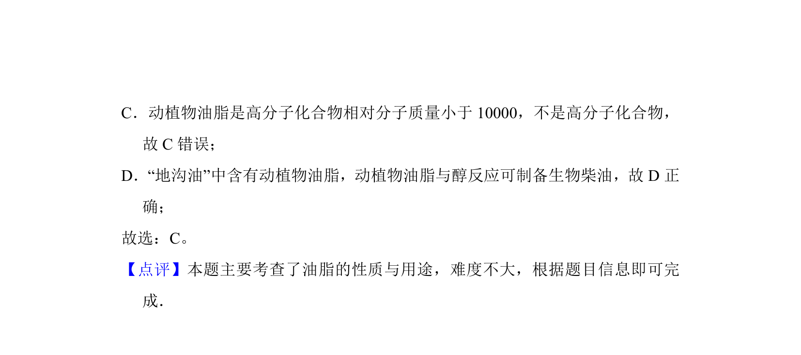

## 题面

## 摘要

本题考查生物柴油的成分、制备及油脂性质等有机化学基本概念

## 关联考点

- [[749-油脂的性质|油脂的性质]]
- [[566-组成与结构|组成与结构]]
- [[717-有机高分子化合物的结构和性质|有机高分子化合物的结构和性质]]

## 答案与解析

> 📄 原 PDF 第 1 页：`素材/真题/吉林/2008-2024·（吉林）化学高考真题/2013年高考化学试卷（新课标Ⅱ）（解析卷）.pdf`
