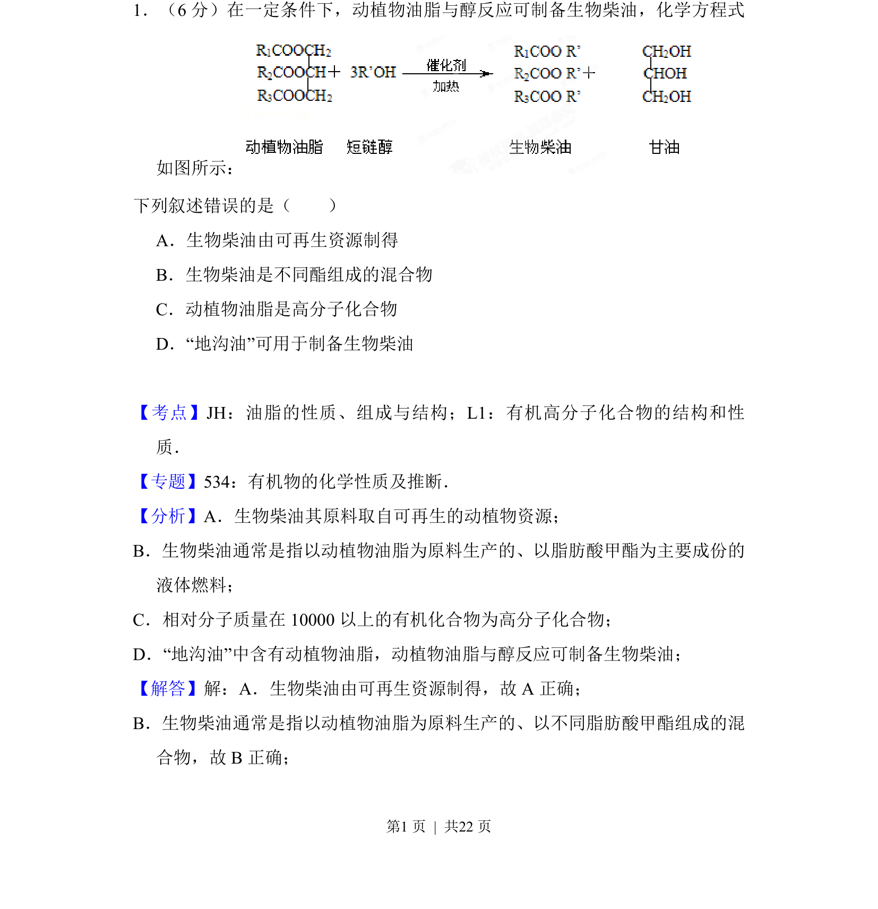
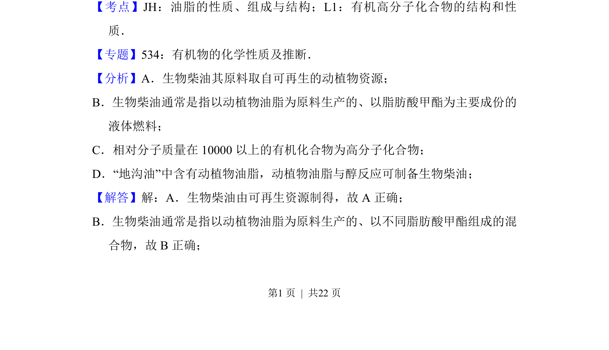
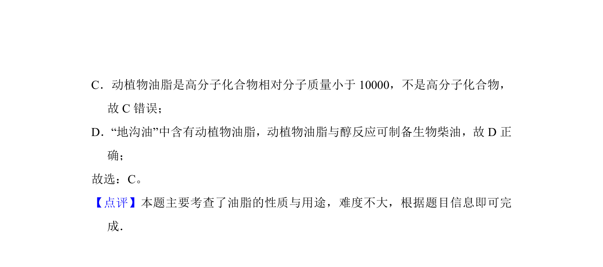

## 题面

## 摘要

本题考查生物柴油的成分、制备及油脂性质等有机化学基本概念

## 关联考点

- [[749-油脂的性质|油脂的性质]]
- [[566-组成与结构|组成与结构]]
- [[717-有机高分子化合物的结构和性质|有机高分子化合物的结构和性质]]

## 答案与解析

> 📄 原 PDF 第 1 页：`素材/真题/吉林/2008-2024·（吉林）化学高考真题/2013年高考化学试卷（新课标Ⅱ）（解析卷）.pdf`

<!-- 题干文本-start -->
## 题干文本
1．（6分）在一定条件下，动植物油脂与醇反应可制备生物柴油，化学方程式
如图所示：
下列叙述错误的是（　　）
A．生物柴油由可再生资源制得
B．生物柴油是不同酯组成的混合物
C．动植物油脂是高分子化合物
D．“地沟油”可用于制备生物柴油
<!-- 题干文本-end -->

<!-- 解析文本-start -->
## 解析文本
【考点】JH：油脂的性质、组成与结构；L1：有机高分子化合物的结构和性
质．菁优网版权所有
【专题】534：有机物的化学性质及推断．
【分析】A．生物柴油其原料取自可再生的动植物资源；
B．生物柴油通常是指以动植物油脂为原料生产的、以脂肪酸甲酯为主要成份的
液体燃料；
C．相对分子质量在10000以上的有机化合物为高分子化合物；
D．“地沟油”中含有动植物油脂，动植物油脂与醇反应可制备生物柴油；
【解答】解：A．生物柴油由可再生资源制得，故A正确；
B．生物柴油通常是指以动植物油脂为原料生产的、以不同脂肪酸甲酯组成的混
合物，故B正确；
<!-- 解析文本-end -->
