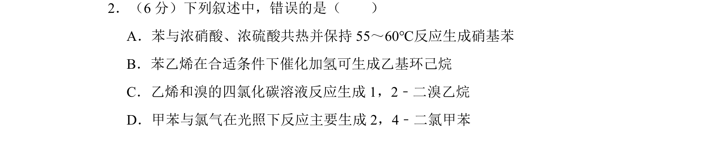
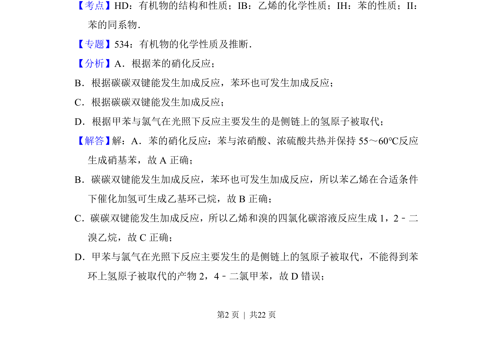
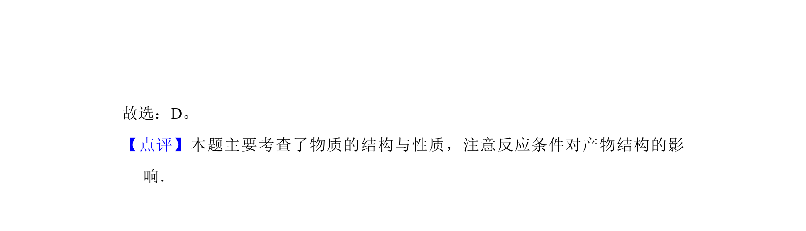

## 题面

## 摘要

考查苯、乙烯、甲苯和苯乙烯等有机物的典型反应与结构性质

## 关联考点

- [[830-苯的硝化|苯的硝化]]
- [[801-碳碳双键加成|碳碳双键加成]]
- [[884-苯环催化加氢|苯环催化加氢]]
- [[559-甲苯光照侧链取代|甲苯光照侧链取代]]

## 答案与解析

> 📄 原 PDF 第 2 页：`素材/真题/吉林/2008-2024·（吉林）化学高考真题/2013年高考化学试卷（新课标Ⅱ）（解析卷）.pdf`

<!-- 题干文本-start -->
## 题干文本
2．（6分）下列叙述中，错误的是（　　）
A．苯与浓硝酸、浓硫酸共热并保持55～60℃反应生成硝基苯
B．苯乙烯在合适条件下催化加氢可生成乙基环己烷
C．乙烯和溴的四氯化碳溶液反应生成1，2﹣二溴乙烷
D．甲苯与氯气在光照下反应主要生成2，4﹣二氯甲苯
<!-- 题干文本-end -->

<!-- 解析文本-start -->
## 解析文本
【考点】HD：有机物的结构和性质；IB：乙烯的化学性质；IH：苯的性质；II：
苯的同系物．菁优网版权所有
【专题】534：有机物的化学性质及推断．
【分析】A．根据苯的硝化反应；
B．根据碳碳双键能发生加成反应，苯环也可发生加成反应；
C．根据碳碳双键能发生加成反应；
D．根据甲苯与氯气在光照下反应主要发生的是侧链上的氢原子被取代；
【解答】 解：A．苯的硝化反应：苯与浓硝酸、浓硫酸共热并保持55～60℃反应
生成硝基苯，故A正确；
B．碳碳双键能发生加成反应，苯环也可发生加成反应，所以苯乙烯在合适条件
下催化加氢可生成乙基环己烷，故B正确；
C．碳碳双键能发生加成反应，所以乙烯和溴的四氯化碳溶液反应生成1，2﹣二
溴乙烷，故C正确；
D．甲苯与氯气在光照下反应主要发生的是侧链上的氢原子被取代，不能得到苯
环上氢原子被取代的产物2，4﹣二氯甲苯，故D错误；
<!-- 解析文本-end -->
