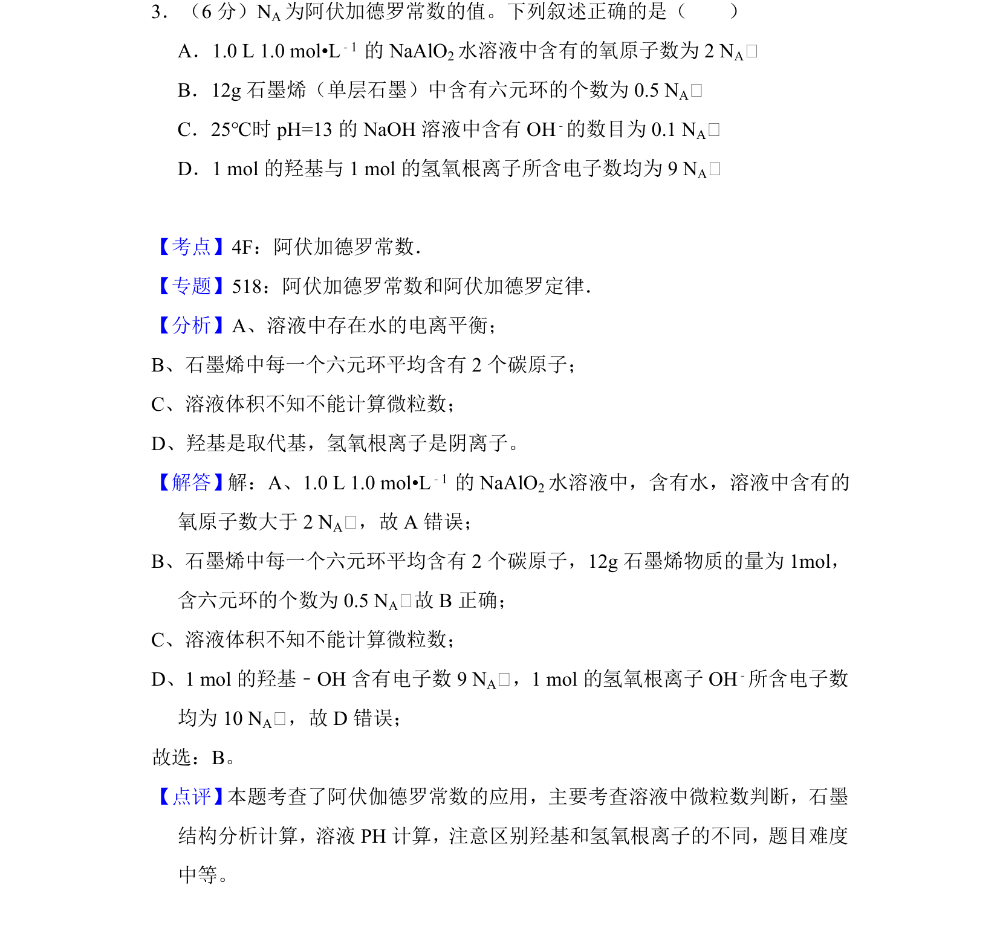
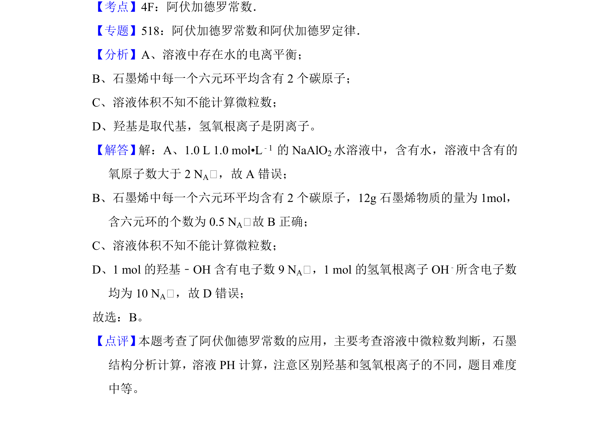

## 题面

## 摘要

本题考查阿伏加德罗常数的应用，涉及溶液中微粒数、石墨结构、pH计算及粒子组成判断。

## 关联考点

- [[450-阿伏伽德罗常数|阿伏加德罗常数]]
- [[690-微粒数计算|微粒数计算]]
- [[799-石墨烯结构|石墨烯结构]]
- [[569-羟基与氢氧根区别|羟基与氢氧根区别]]

## 答案与解析

> 📄 原 PDF 第 3 页：`素材/真题/吉林/2008-2024·（吉林）化学高考真题/2013年高考化学试卷（新课标Ⅱ）（解析卷）.pdf`
