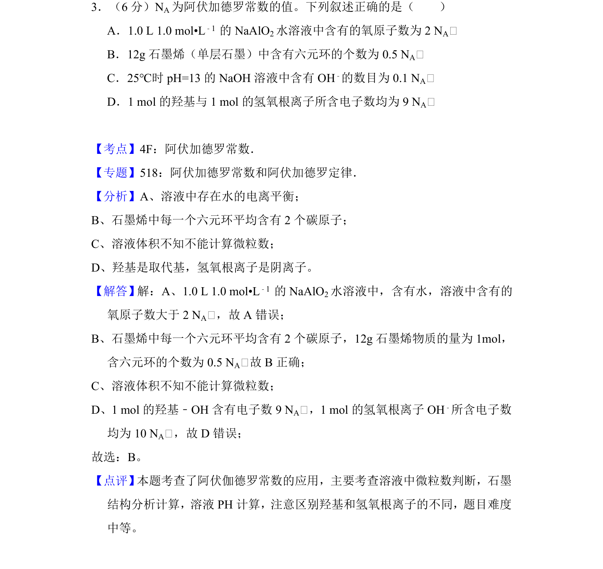
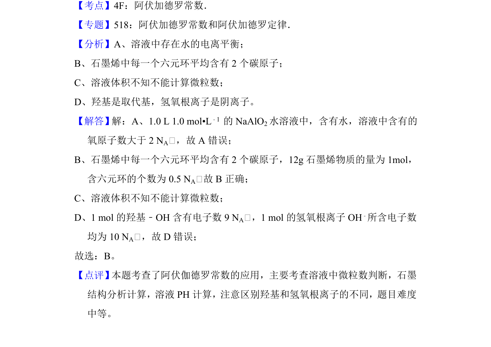

## 题面

## 摘要

本题考查阿伏加德罗常数的应用，涉及溶液中微粒数、石墨结构、pH计算及粒子组成判断。

## 关联考点

- [[450-阿伏伽德罗常数|阿伏加德罗常数]]
- [[689-微粒数计算|微粒数计算]]
- [[798-石墨烯结构|石墨烯结构]]
- [[568-羟基与氢氧根区别|羟基与氢氧根区别]]

## 答案与解析

> 📄 原 PDF 第 3 页：`素材/真题/吉林/2008-2024·（吉林）化学高考真题/2013年高考化学试卷（新课标Ⅱ）（解析卷）.pdf`

<!-- 题干文本-start -->
## 题干文本
3．（6分）N A为阿伏加德罗常数的值。下列叙述正确的是（　　）
A．1.0 L 1.0 mol•L﹣1 的NaAlO 2水溶液中含有的氧原子数为2 N A￿
B．12g石墨烯（单层石墨）中含有六元环的个数为0.5 N A￿
C．25℃时pH=13的NaOH溶液中含有OH ﹣的数目为0.1 N A￿
D．1 mol的羟基与1 mol的氢氧根离子所含电子数均为9 N A￿
<!-- 题干文本-end -->

<!-- 解析文本-start -->
## 解析文本
【考点】4F：阿伏加德罗常数．菁优网版权所有
【专题】518：阿伏加德罗常数和阿伏加德罗定律．
【分析】A、溶液中存在水的电离平衡；
B、石墨烯中每一个六元环平均含有2个碳原子；
C、溶液体积不知不能计算微粒数；
D、羟基是取代基，氢氧根离子是阴离子。
【解答】解：A、1.0 L 1.0 mol•L﹣1 的NaAlO 2水溶液中，含有水，溶液中含有的
氧原子数大于2 N A￿，故A错误；
B、石墨烯中每一个六元环平均含有2个碳原子，12g石墨烯物质的量为1mol，
含六元环的个数为0.5 N A￿故B正确；
C、溶液体积不知不能计算微粒数；
D、1 mol的羟基﹣OH含有电子数9 N A￿，1 mol的氢氧根离子OH ﹣所含电子数
均为10 N A￿，故D错误；
故选：B。
【点评】 本题考查了阿伏伽德罗常数的应用，主要考查溶液中微粒数判断，石墨
结构分析计算，溶液PH计算，注意区别羟基和氢氧根离子的不同，题目难度
中等。
<!-- 解析文本-end -->
