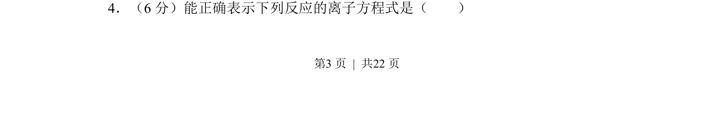
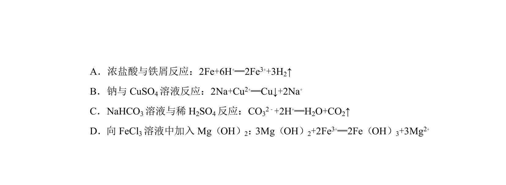
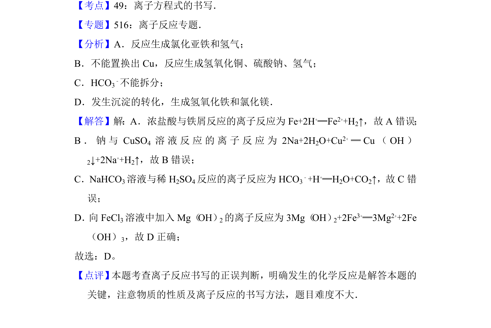

## 题面

## 摘要

本题考查离子方程式的书写正误判断与反应原理分析

## 关联考点

- [[169-离子反应|离子反应]]
- [[162-氧化还原反应|氧化还原]]
- [[628-化学计量|化学计量]]
- [[777-物质拆写|物质拆写]]

## 答案与解析

> 📄 原 PDF 第 3 页：`素材/真题/吉林/2008-2024·（吉林）化学高考真题/2013年高考化学试卷（新课标Ⅱ）（解析卷）.pdf`
