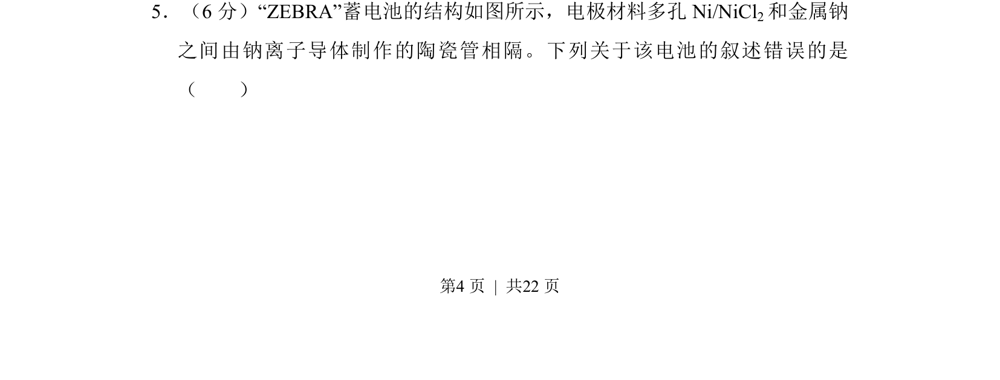
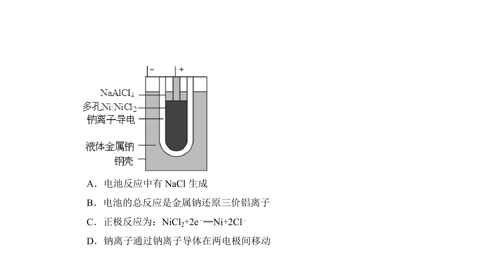
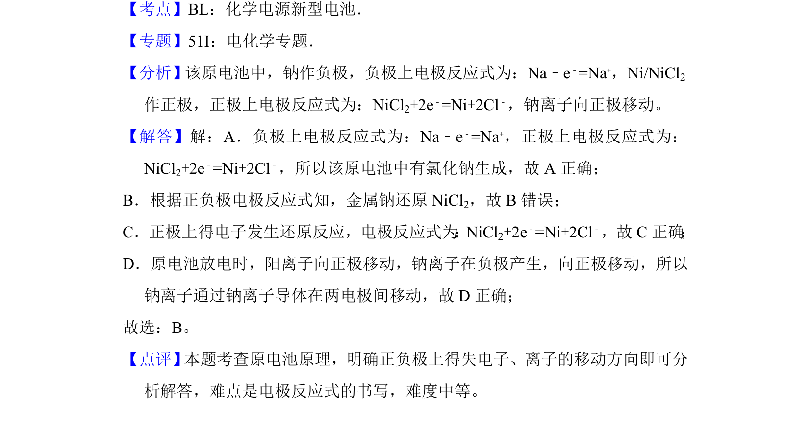

## 题面

## 摘要

ZEBRA蓄电池结构及工作原理分析，判断电极反应与离子迁移等叙述正误。

## 关联考点

- [[362-二次电池|二次电池]]
- [[794-电极反应|电极反应]]
- [[900-离子导体|离子导体]]
- [[862-钠离子迁移|钠离子迁移]]

## 答案与解析

> 📄 原 PDF 第 4 页：`素材/真题/吉林/2008-2024·（吉林）化学高考真题/2013年高考化学试卷（新课标Ⅱ）（解析卷）.pdf`
