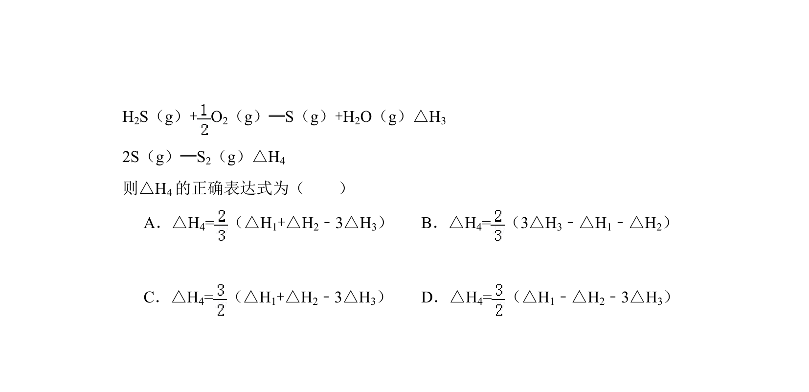
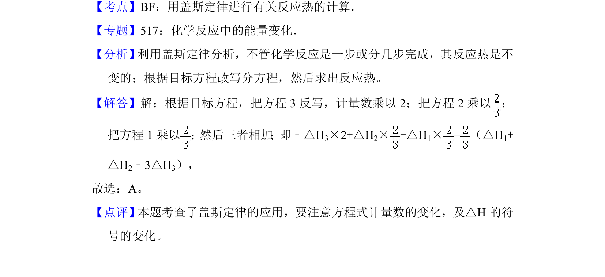

## 题面

## 摘要

考查利用盖斯定律计算反应热，涉及天然气脱硫反应中的焓变关系。

## 关联考点

- [[311-盖斯定律|盖斯定律]]
- [[768-热化学方程式与反应热计算|反应热计算]]
- [[309-热化学方程式|热化学方程式]]

## 答案与解析

> 📄 原 PDF 第 5 页：`素材/真题/吉林/2008-2024·（吉林）化学高考真题/2013年高考化学试卷（新课标Ⅱ）（解析卷）.pdf`
