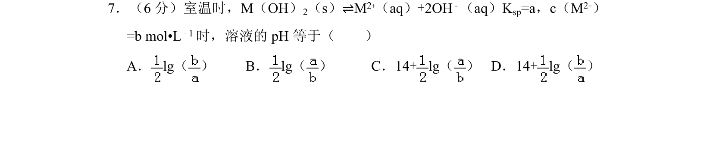
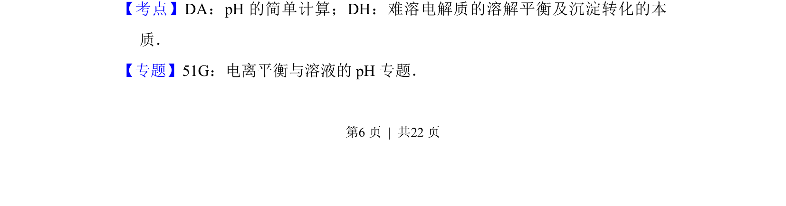
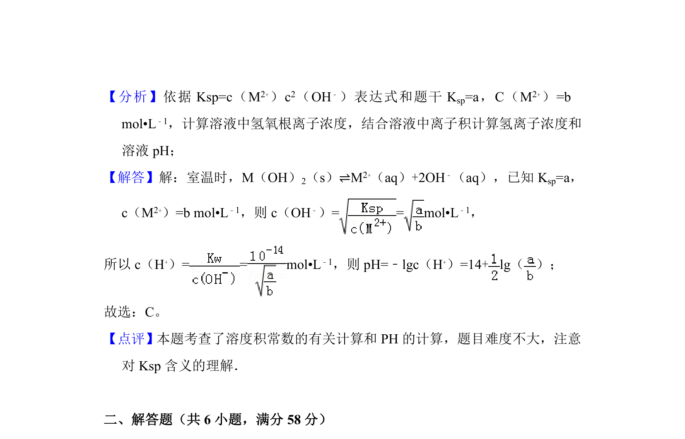

## 题面

## 摘要

该题考查难溶电解质溶解平衡与溶液pH的计算关系，需结合溶度积常数求算氢氧根浓度进而确定pH。

## 关联考点

- [[316-pH计算|pH计算]]
- [[762-溶度积|溶度积]]
- [[764-溶解平衡|溶解平衡]]

## 答案与解析

> 📄 原 PDF 第 6 页：`素材/真题/吉林/2008-2024·（吉林）化学高考真题/2013年高考化学试卷（新课标Ⅱ）（解析卷）.pdf`
